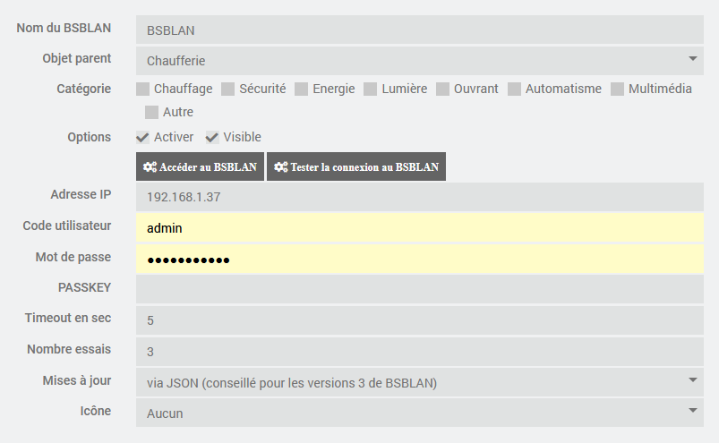
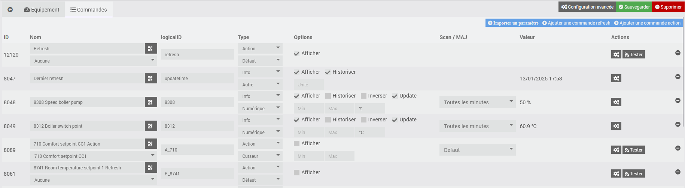
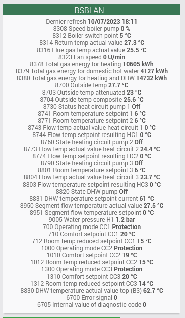
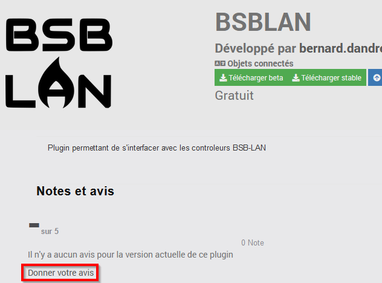

<!--  
Última modificación: 28/07/2026 16:00:31
-->

# Complemento BSBLAN

Complemento que permite conectarse con el controlador BSB-LPB-LAN.

El controlador BSB-LPB-LAN es fruto de un proyecto cuyo objetivo es la comunicación con las tarjetas SIEMENS que controlan numerosas calderas, bombas de calor y otros dispositivos industriales.

La documentación es muy completa y se puede consultar en esta dirección <https://docs.bsb-lan.de>. El material se puede adquirir a través de Frederik Holst <bsb@code-it.de>.

El BSB-LAN puede sustituir ventajosamente a los controladores OZW suministrados por Siemens. La solución es mucho más económica, permite acceder a todos los parámetros de las tarjetas de Siemens (a diferencia del OZW) y los tiempos de acceso a las tarjetas son mucho más rápidos. Además, es posible enviar la temperatura de las zonas calefactadas sin necesidad de pasar por un sensor de ambiente.

La comunicación entre el complemento y el BSBLAN se realiza a través de API web.

# Instalación y configuración del controlador BSBLAN

Para que el complemento funcione correctamente, es necesario que el módulo BSB-LAN esté operativo.

Para la instalación y la configuración, consulta la excelente documentación disponible en la página web del proyecto.

Si se desea modificar algún parámetro, habrá que habilitarlo en la configuración de BSBLAN.

El complemento se ha probado con las versiones 3.2 y 4.2. En principio, el complemento debería funcionar con versiones anteriores, ya que las llamadas a las API son bastante básicas y deben existir desde hace muchas versiones.

# Configuración del complemento

Una vez instalado el complemento, hay que activarlo.

También puedes configurar si se utiliza un cron independiente. Esto permite que, si el cron del plugin se bloquea, no se bloqueen los demás crons, y que el plugin no se vea bloqueado por otros crons ejecutados por otros plugins.

Puedes activar el nivel de registro «Debug» para realizar un seguimiento de la actividad del complemento e identificar posibles problemas.

# Configuración de los dispositivos

Se puede acceder a la configuración de los dispositivos desde el menú del complemento (menú Complementos, Objetos conectados y, a continuación, BSBLAN).

Haz clic en «Añadir» para configurar el controlador BSBLAN.

Indica la configuración del BSBLAN:

-   **Nombre**: nombre del BSBLAN
-   **Objeto principal**: indica el objeto principal al que pertenece el equipo
-   **Categoría**: indica la categoría de Jeedom del equipo
-   **Activar**: permite activar el equipo
-   **Visible**: lo muestra en el panel de control
-   **Dirección IP**: IP del dispositivo
-   **Nombre de usuario y contraseña**: datos de acceso al servidor web
-   **Passkey**: prefijo que debe incluirse en las solicitudes HTML (véase la documentación de BSBLAN)
-   **Timeout**: tiempo máximo durante el cual se espera una respuesta a la solicitud HTTP (15 segundos si el campo está vacío)
-   **Actualizaciones**: método utilizado para realizar las actualizaciones, ya sea mediante JSON o mediante un comando directo en la URL. En algunos casos, se ha observado que las actualizaciones a través de JSON no se llevaban a cabo. No ha sido posible determinar el motivo. En ese caso, se puede utilizar la opción mediante el comando /S, que funciona siempre. Sin embargo, en la versión 3 de BSBLAN, algunos comandos que requieren especificar el indicador INFO (por ejemplo, enviar la temperatura ambiente) no se tienen en cuenta.
-   **Número de intentos**: número de veces que se envía la orden en caso de fallo (3 si el campo está vacío)
-   **Icono**: permite seleccionar un tipo de icono para el dispositivo en el panel de configuración

Es posible asociar un icono específico al BSBLAN. También se puede personalizar un icono de tipo «perso» añadiendo la imagen correspondiente (por ejemplo, «perso1.png» para el icono «perso1») en el directorio «plugin_info» del complemento.

Los siguientes botones permiten realizar las siguientes funciones:

-   **Acceder a BSBLAN**: permite iniciar sesión en la web de BSBLAN
-   **Probar la conexión con el BSBLAN**: permite comprobar si los parámetros de conexión son correctos (no olvides guardar la configuración antes de hacer clic en el botón). Se muestra el número de versión del BSBLAN.

# Comandos asociados a los equipos

Por defecto, se crean dos comandos:

- Última actualización: comando de información que indica cuándo se actualizó por última vez la información del BSBLAN
- Refresh: comando de acción que permite actualizar todos los parámetros para los que está activada la actualización

Están disponibles los siguientes botones:

- Importar un parámetro: permite crear un comando de información para un parámetro específico
- Añadir un comando «refresh»: permite forzar la recuperación del valor del parámetro
- Añadir un comando de acción: permite modificar el valor del parámetro (cuando el servidor web lo permita)

# Análisis de los campos del pedido

Para cada comando relacionado con un parámetro, además de los campos habituales de Jeedom, encontramos:

- el LogicalID:
  - para comandos de tipo «info», igual al código del parámetro
  - para los comandos de acción, igual a «A_» seguido del código del parámetro
  - para los comandos de actualización, igual a «R_» seguido del código del parámetro
- la casilla de selección que permite elegir si se solicita o no la actualización del parámetro
- Para los comandos de información, el campo «scan» indica la frecuencia de actualización del parámetro
- Para los comandos de acción, el campo «MAJ» permite especificar un modo de actualización concreto

# Widget

Este es un ejemplo de widget. Se puede modificar el nombre de los comandos para que sean más descriptivos.

# Opiniones

Si te gusta este plugin, te agradeceríamos que dejaras una valoración y un comentario en Jeedom Market, siempre nos hace mucha ilusión: <https://jeedom.com/market/index.php?v=d&p=market_display&id=4424#>
