<!--  
Última modificação: 27/07/2026 15:27:46
-->

# Plugin EcoLegrand

Plugin que permite recuperar os dados dos contadores ecológicos Legrand da geração anterior (referência 412000).

Ao contrário dos novos contadores ecológicos, cujos dados só estão acessíveis através da nuvem, os contadores ecológicos antigos podem ser acedidos através de uma interface Web local. Em particular, é possível visualizar diretamente o consumo instantâneo, o que não é possível com os novos contadores ecológicos (é necessário visualizar os dados diretamente no contador ecológico).

Os contadores ecológicos 412000 já não são comercializados desde 2020, mas continuam a ser uma opção interessante em comparação com a versão atual.

A comunicação entre o plugin e o contador ecológico é feita através da recuperação de dados de ficheiros JSON definidos pelo utilizador. É o próprio utilizador que define, no ficheiro JSON, os dados que pretende recuperar.

A função básica do plugin é a recolha de dados dos contadores ecológicos. A sua análise deve ser feita por outros meios (virtuais, cenários, etc.) e requer um certo domínio do Jeedom para poder manipular os dados.

# Instalação e configuração do contador ecológico EcoLegrand

Para que o plugin funcione corretamente, é necessário que o contador ecológico esteja operacional e acessível através da interface Web.

O plugin foi testado com a versão 3.0.17, que é a última publicada e não sofrerá mais alterações, uma vez que este contador ecológico já não é mantido.

# Definição dos dados a recuperar num ficheiro JSON

Os dados a recuperar estão definidos num ficheiro JSON que deve ser copiado para o contador ecológico.

{   
"contador_C1":~LG536 2 12724$,
"contador_C2":~LG536 4 12724$,
"contador_C3":~LG536 6 12724$,
"contador_C4":~LG536 8 12724$,
"contador_C5":~LG536 10 12724$,
"Contador_EF":~LG538 0 12 907$,
«Contador_EC»:~LG538 1 12907$
}

O ficheiro JSON tem o formato acima indicado. Há uma linha por cada dado a recuperar (tenha cuidado para não colocar uma vírgula na última linha e para utilizar aspas duplas).

Cada linha inclui o nome do dado e a referência interna definida no ecocontador. O ficheiro disponível na ligação <https://github.com/bernard-dandrea/documentation/blob/main/jeedom-EcoLegrand/doc/fr_FR/JSON_codes.txt> apresenta uma lista não exaustiva das referências que podem ser utilizadas.

Pode consultar o fórum seguinte <https://easydomoticz.com/forum/viewtopic.php?t=1942&start=20> para obter mais informações.

# Cópia do ficheiro JSON para o ecocontador

A cópia é efetuada através do protocolo FTP. Pode utilizar-se o programa FileZilla.

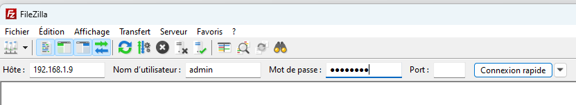

Inicie sessão indicando o endereço IP e os códigos de acesso (por predefinição: admin / password).

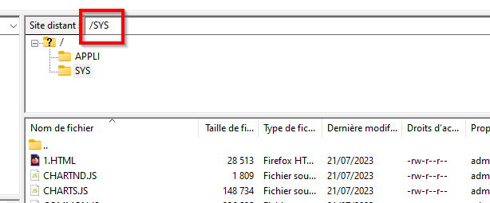

Aceda ao diretório SYS.

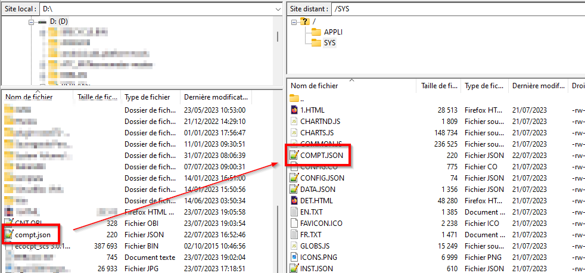

Copie o ficheiro JSON. Tenha em atenção que o nome do ficheiro deve ser bastante curto; caso contrário, a cópia não será efetuada.

No diretório SYS encontram-se os ficheiros HTML utilizados pelo ecocontador. Ao analisá-los, poderá encontrar a referência às variáveis que lhe interessam.

# Problema com os contadores de energia

O fórum acima explica muito bem o problema encontrado com os contadores de energia (os contadores de impulsos não são afetados).

Parece que o software do ecocontador gere internamente estes contadores com variáveis do tipo float 32. Estas têm uma precisão de cerca de 7 casas decimais.

Estes contadores são atualizados a cada segundo e são geridos em KWh com 6 casas decimais.

Por isso, quando se ultrapassam os 10 kWh, começa-se a perder precisão, sobretudo se houver pouco consumo na linha em questão. Isto torna-se muito prejudicial quando se ultrapassam os 100 kWh.

Para resolver este problema, o plugin pode zerar os contadores a partir de um limiar definido pelo utilizador (normalmente entre 1 e 10 kWh). O plugin gere o desfasamento e fornece um valor acumulado do contador. Note-se que esta zeragem do contador interno pode alterar as estatísticas fornecidas pelo ecocontador.

# Instalação do plugin

Depois de instalar o plugin, é necessário ativá-lo.

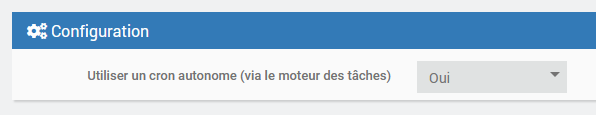

Também pode definir se é utilizada uma tarefa cron autónoma. Isto permite evitar que as outras tarefas cron fiquem bloqueadas caso a tarefa cron do plugin fique bloqueada e evita que esta seja bloqueada por outras tarefas cron executadas por outros plugins.

Pode ativar o nível de registo «Debug» para acompanhar a atividade do plugin e identificar eventuais problemas.

# Configuração dos equipamentos

A configuração dos equipamentos está acessível a partir do menu do plugin (menu Plugins, Energia e, em seguida, Ecocompteur Legrand).

Clique em «Adicionar» para configurar um contador ecológico.

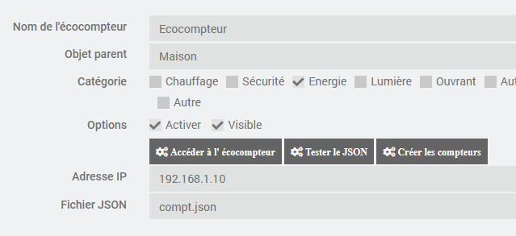

Indique a configuração do contador ecológico:

-   **Nome**: nome do contador ecológico
-   **Objeto pai**: indica o objeto pai ao qual o equipamento pertence
-   **Categoria**: indica a categoria Jeedom do equipamento
-   **Ativar**: permite ativar o equipamento
-   **Visível**: torna-o visível no painel de controlo
-   **Endereço IP**: IP do equipamento
-   **Ficheiro JSON**: ficheiro JSON que contém a definição dos dados a recuperar

Os botões seguintes permitem as seguintes funções:

-   **Aceder ao contador ecológico**: permite iniciar uma sessão na Web no contador ecológico
-   **Testar o JSON**: permite testar o ficheiro JSON e verificar se os parâmetros devolvidos estão corretos
-   **Criar os contadores**: gera os comandos de informação correspondentes aos contadores

# Comandos associados aos equipamentos

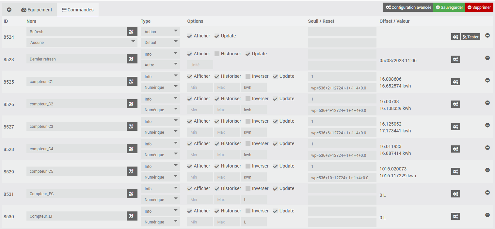

Por predefinição, são criados dois comandos:

- Última atualização: indica quando a informação mais recente do contador ecológico foi atualizada
- Refresh: permite forçar a atualização dos contadores. Um cron executa a atualização a cada minuto.

É criado um comando de informação para cada um dos contadores. Para cada um deles, além dos campos habituais do Jeedom, encontram-se:

- a opção de atualização que permite solicitar ou não a atualização do contador
- o limiar, que é o valor a partir do qual o contador é reiniciado a zero
- o comando que repõe o contador a zero
- o desvio, que corresponde ao valor acumulado do contador no momento da reinicialização
- o valor atual do contador (offset + valor do contador no ecocontador)

O comando que permite a reinicialização dos contadores e do tipo http://192.168.1.xxx/wp.cgi?wp=536+X+12724+-1+-1+4+0.0, ou seja, wp.cgi? seguido das referências dos contadores e de valores fixos; por exemplo, wp=536+2+12724+-1+-1+4+0.0 para o contador_C1. Consulte o fórum <https://easydomoticz.com/forum/viewtopic.php?t=1942&start=120> para mais informações.

Para os campos não numéricos, altere o tipo de campo de «Numérico» para «Outro» (o limiar e o desvio não fazem sentido neste caso).

# Widget

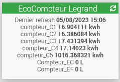

Eis um exemplo de widget. Note-se que é necessário indicar as unidades manualmente no comando.

# Aproveitamento dos dados

Através de cenários, virtuais ou de procedimentos PHP, é possível gerar os seus próprios indicadores a partir dos contadores.

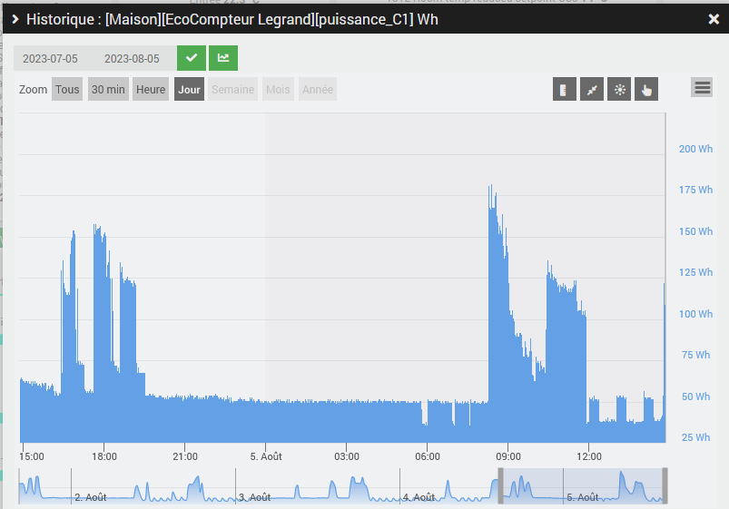

Por exemplo, é possível gerar um relatório de potência com base no cálculo da potência média entre duas medições.

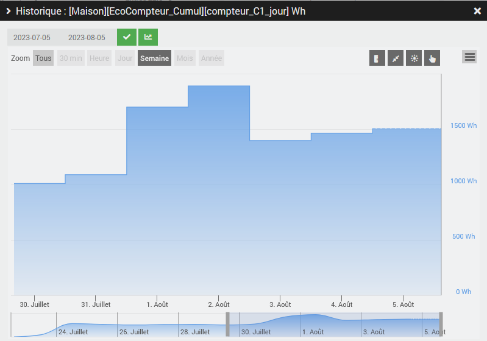

Ou gerar relatórios diários do consumo de eletricidade.

# Perguntas frequentes

Pode acontecer que o ficheiro JSON devolvido pelo ecocontador não possa ser descodificado.

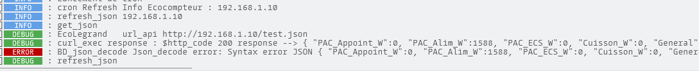

Nesse caso, é exibida uma mensagem no registo.

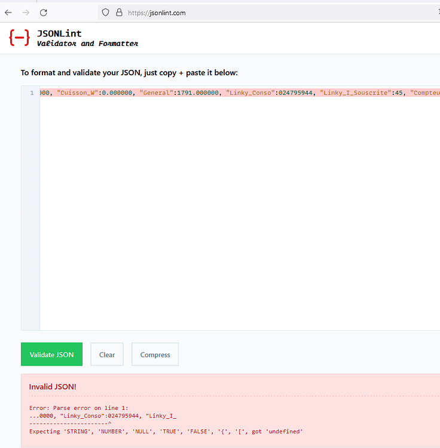

Para identificar a origem do erro, recupere do registo o ficheiro JSON devolvido pelo contador ecológico e teste-o no site <https://jsonlint.com/>.

Neste caso, o erro deve-se ao facto de a rotina de conversão não aceitar o 0 inicial na entrada «Linky_Conso»:024795944.

É possível corrigir isto colocando o valor 024795944 entre aspas.

Para tal, altere o ficheiro de definição dos dados a recuperar e adicione aspas à entrada correspondente:

\"Linky_Conso\":~LG526 1 12005$, --> \"Linky_Conso\":\"~LG526 1 12005$\",

A sequência «024795944» será então considerada como uma sequência e não haverá mais problemas durante a conversão.

# Tradução

A interface, as mensagens enviadas nos registos e a documentação estão traduzidas para as 5 línguas suportadas pelo Jeedom (obrigado ao @mips pelo desenvolvimento do ga-translation e do docs-translations). Se forem detetados erros de tradução, pode abrir um pedido de suporte e, se possível, anexar o ficheiro de tradução corrigido (localizado no diretório core/i18n do plugin).

# Opiniões

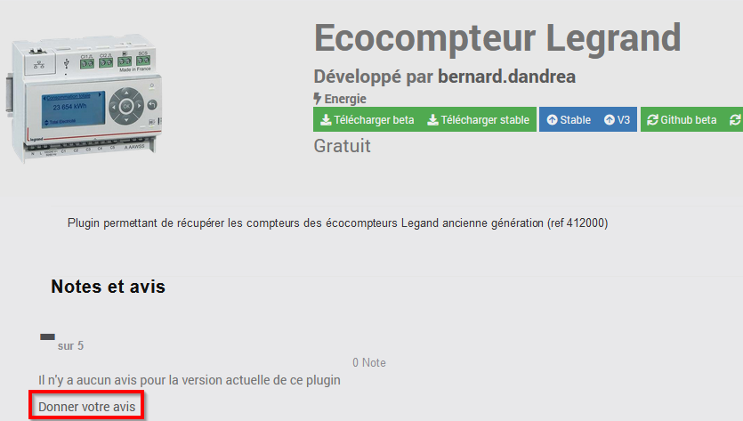

Se gostar deste plugin, por favor, deixe uma avaliação e um comentário no Jeedom Market, é sempre um prazer: <https://jeedom.com/market/index.php?v=d&p=market_display&id=4430#>
