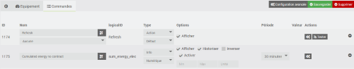

<!--  
Zuletzt geändert: 26.07.2026, 18:45:10
-->

# EcoNetatmo-Plugin

Plugin zum Abrufen der Verbrauchsdaten von Legrand-Ecocompteurs vom Typ Drivia with NetAtmo (Art.-Nr. 41203x).

Dieses Plugin wurde auf der Grundlage des Standard-Plugins „netatmoWeather“ entwickelt.

Dieses Plugin nutzt die von Netatmo bereitgestellten APIs (siehe folgenden Link <https://dev.netatmo.com/apidocumentation/control>).

# Abrufen der Anmeldedaten

Um auf die Daten Ihres Ecocompteur zugreifen zu können, benötigen Sie eine client\_id und einen client\_secret, die auf der Website <https://dev.netatmo.com> generiert wurden.

Falls noch nicht geschehen, erstellen Sie bitte ein Konto unter <https://auth.netatmo.com/fr-fr/access/signup?next_url=https%3A%2F%2Fdev.netatmo.com%2Fbusiness-showcase>

Sobald Sie angemeldet sind, gehen Sie zum Anwendungsmenü ( <https://dev.netatmo.com/apps/> ) und klicken Sie dann auf „Create“.

Füllen Sie das Formular aus und klicken Sie auf „Speichern“.

Die „Client-ID“ und der „Client-Secret“ wurden generiert. Sie können diese zur Konfiguration des Plugins verwenden.

# Abruf der Tokens

Die Tokens ermöglichen den Zugriff auf Ihre Daten auf den Netatmo-Servern (siehe OAuth-2-Autorisierungsstandard).

Diese können direkt auf der Anwendungsseite generiert werden.

Wählen Sie den Bereich „read_magellan“ aus und klicken Sie auf „Generate Token“.

Nachdem Sie den Zugriff auf Ihre Daten genehmigt haben, werden die Tokens generiert.

# Einrichtung des Plugins

Sobald das Plugin installiert ist, müssen Sie es aktivieren und Ihre Netatmo-Anmeldedaten eingeben:

-   **Kunden-ID**: Ihre Kunden-ID (siehe Abschnitt „Konfiguration“)
-   **Geheimer Schlüssel**: Ihr geheimer Schlüssel (siehe Abschnitt „Konfiguration“)
-   **Zugriffstoken**: Ein Token, das den Zugriff auf Ihre Daten auf den Netatmo-Servern ermöglicht
-   **Refresh-Token**: Ein Token, mit dem der Zugriffstoken aktualisiert werden kann

Die Verwaltung der Tokens erfolgt über das Plugin. Sollten diese beispielsweise nach einer längeren Inaktivitätsphase ungültig werden (siehe Protokolle), müssen neue Tokens generiert und die Konfiguration des Plugins mit den neuen Tokens aktualisiert werden.

Sie können außerdem festlegen, ob ein eigenständiger Cron-Job verwendet wird. Dadurch werden andere Cron-Jobs nicht blockiert, falls der Cron-Job des Plugins abstürzt, und das Plugin selbst wird nicht durch andere Cron-Jobs blockiert, die für andere Plugins gestartet werden.

Sie können die Debug-Protokollstufe aktivieren, um die Aktivität des Plugins zu verfolgen und eventuelle Probleme zu identifizieren.

# Konfiguration der Geräte

Die Konfiguration der Netatmo-Geräte erfolgt über das Menü des Plugins (Menü „Plugins“, „Energie“ und dann „EcoNetAtmo“):

Klicken Sie auf „Synchronisierung“, um die Erstellung der Geräte zu starten. Zum Abrufen der Informationen wird die API /homesdata verwendet (siehe <https://dev.netatmo.com/apidocumentation/control#homesdata>).

Die Zähler für die Stromleitungen wurden angelegt. Pro Leitung gibt es ein Gerät.

Auf der Registerkarte „Ausstattung“ finden Sie die gesamte Konfiguration Ihrer Ausstattung:

-   **Name**: Name Ihres Zählers (dieser wird aus der Netatmo-Konfiguration übernommen)
-   **Übergeordnetes Objekt**: Gibt das übergeordnete Objekt an, zu dem das Gerät gehört
-   **Kategorie**: Gibt die Jeedom-Kategorie des Geräts an
-   **Aktivieren**: Damit können Sie Ihre Geräte aktivieren
-   **Sichtbar**: Macht es auf dem Dashboard sichtbar
-   **Modul-ID**: Gibt die eindeutige Kennung des Geräts bei Netatmo an
-   **Verbrauchstyp**: Gibt den Typ Ihres Geräts bei Netatmo an
-   **Quellentyp**: Gibt die Energiequelle Ihres Geräts bei Netatmo an
-   **Symbol**: Hier können Sie im Konfigurationsfenster einen Symboltyp für Ihr Gerät auswählen
  
Über die Schaltfläche „Zähler importieren“ können Sie die zu den Geräten gehörenden Befehle erstellen. Dies geschieht bei der Erstellung des Geräts und ist nur dann sinnvoll, wenn Sie einen Befehl gelöscht haben.

Auf der Registerkarte „Befehle“ finden Sie die Liste der Befehle (diese werden beim Anlegen des Geräts generiert).

Mit dem Befehl „Refresh“ können Sie die sofortige Abfrage der Zählerwerte auslösen. Standardmäßig erfolgt eine Abfrage alle 10 Minuten.

Die übrigen Befehle beziehen sich auf die von Netatmo bereitgestellten Messwerte (siehe API /getmesure <https://dev.netatmo.com/apidocumentation/control#getmeasure>). Für jeden dieser Befehle werden zusätzlich zu den üblichen Jeedom-Werten folgende Angaben angezeigt:

-   Der auf dem Dashboard angezeigte Name
-   Die logicalID, die dem „Typ“ in der Netatmo-API entspricht
-   die Möglichkeit, die Zählerauslesung zu aktivieren oder zu deaktivieren
-   Der Zeitraum, der dem „scale“ in der Netatmo-API entspricht (für den Daten abgerufen werden sollen; es werden nur die von der Netatmo-API zugelassenen Werte angezeigt)

# Widget

Hier ist das Standard-Widget.

# Häufig gestellte Fragen

>**Wie hoch ist die Bildwiederholfrequenz?**
>
>Das Plugin ruft die Daten alle 10 Minuten ab. Der Stromzähler übermittelt seine Messwerte jedoch etwa alle 3 Stunden, sodass es zu dieser Verzögerung bei der Datenabfrage kommen kann.

>**Kann ich die Gas- und Wasserzähler ablesen?**
>
>Das Plugin ist dazu in der Lage. Leider gibt die Netatmo-API nicht an, welcher „Typ“ für den Abruf dieser Werte verwendet werden soll. Es wurde eine Anfrage an das für die Entwicklung der API zuständige Team gerichtet, jedoch liegt bislang noch keine Antwort vor.

# Übersetzung

Die Benutzeroberfläche, die in den Protokollen ausgegebenen Meldungen und die Dokumentation sind in die fünf von Jeedom unterstützten Sprachen übersetzt (vielen Dank an @mips für die Entwicklung von ga-translation und docs-translations). Sollten Ihnen Übersetzungsfehler auffallen, können Sie eine Supportanfrage stellen und, wenn möglich, die korrigierte Übersetzungsdatei (zu finden im Verzeichnis core/i18n des Plugins) beifügen.

# Bewertungen

Wenn Ihnen dieses Plugin gefällt, hinterlassen Sie bitte eine Bewertung und einen Kommentar im Jeedom Market – das freut uns immer: <https://jeedom.com/market/index.php?v=d&p=market_display&id=4413#>
