<!--  
Last Modified: July 26, 2026, 6:45:10 PM
-->

# EcoNetatmo Plugin

Plugin for retrieving consumption data from Legrand Drivia with NetAtmo-type Ecocounters (ref. 41203x).

This plugin was developed based on the standard netatmoWeather plugin.

This plugin uses the APIs provided by Netatmo (see the following link <https://dev.netatmo.com/apidocumentation/control>).

# Retrieving login information

To access your Ecocompteur data, you must have a client_id and a client_secret generated on the website <https://dev.netatmo.com>.

If you haven't already, create an account <https://auth.netatmo.com/fr-fr/access/signup?next_url=https%3A%2F%2Fdev.netatmo.com%2Fbusiness-showcase>

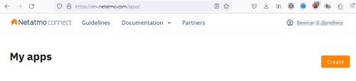

Once logged in, go to the apps menu ( <https://dev.netatmo.com/apps/> ) and click "Create."

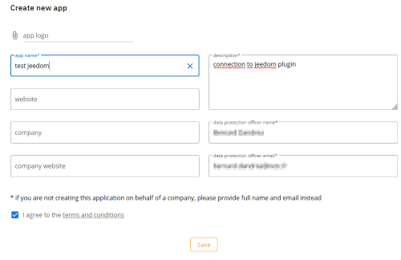

Fill out the form and click 'Save'.

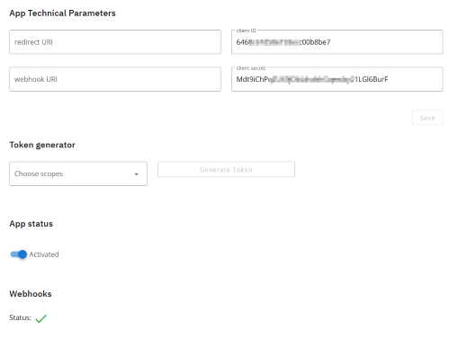

The 'client ID' and 'client secret' have been generated. You can use them to configure the plugin.

# Token Retrieval

Tokens grant access to your data on Netatmo servers (see the OAuth 2.0 authorization standard).

You can generate them directly on the app page.

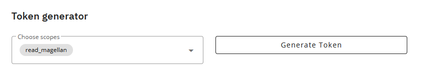

Select the 'read_magellan' scope and click 'Generate Token'.

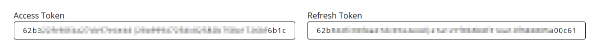

After you grant access to your data, tokens are generated.

# Plugin Configuration

Once the plugin is installed, you'll need to activate it and enter your Netatmo login information:

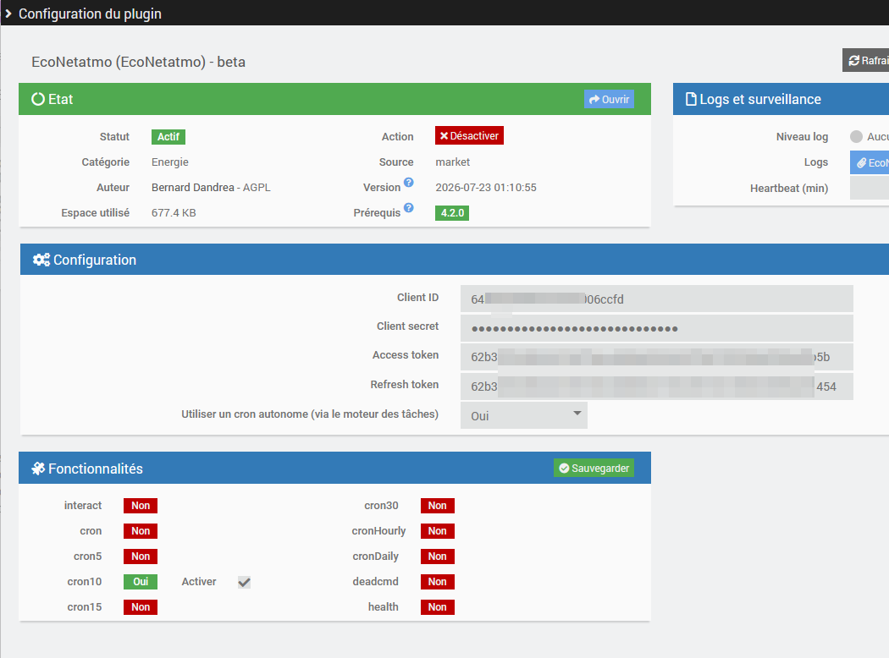

-   **Client ID**: Your client ID (see the configuration section)
-   **Secret client**: your secret client (see the configuration section)
-   **Access token**: a token that grants access to your data on Netatmo's servers
-   **Refresh token**: a token used to refresh the access token

The plugin handles token management. If the tokens become invalid (see the logs)—for example, after a long period of inactivity—you will need to generate new ones and update the plugin's configuration with the new tokens.

You can also specify whether to use a standalone cron job. This prevents other cron jobs from being blocked if the plugin's cron job freezes, and ensures that the plugin's cron job isn't blocked by other cron jobs running for other plugins.

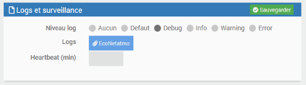

You can enable the Debug log level to monitor the plugin's activity and identify any issues.

# Device Setup

You can configure Netatmo devices from the plugin menu (Plugins menu, Energy, then EcoNetAtmo):

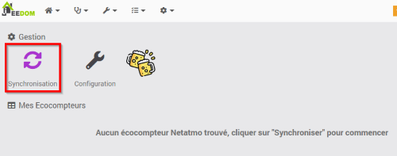

Click Synchronization to start creating devices. The /homesdata API is used to retrieve the information (see <https://dev.netatmo.com/apidocumentation/control#homesdata>).

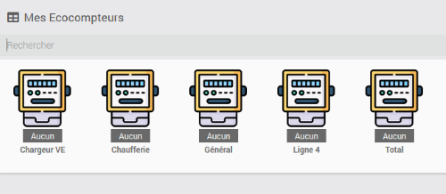

The meters for the power lines have been created. There is one device per line.

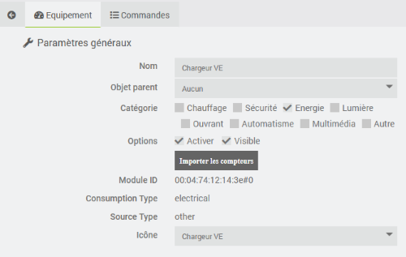

In the "Equipment" tab, you'll find all the settings for your equipment:

-   **Name**: Name of your meter (this is taken from the Netatmo settings)
-   **Parent object**: Specifies the parent object to which the device belongs
-   **Category**: indicates the Jeedom category of the device
-   **Activate**: turns your device active
-   **Visible**: Makes it visible on the dashboard
-   **Module ID**: indicates the device’s unique identifier at Netatmo
-   **Consumption Type**: indicates the type of your Netatmo device
-   **Source Type**: indicates the power type for your Netatmo device
-   **Icon**: Allows you to select an icon type for your device in the control panel
  
The "Import Meters" button allows you to create the commands corresponding to the device. This is done when the device is created and is only useful if you have deleted a command.

In the "Commands" tab, you'll find a list of commands (these are generated when the device is created).

The "Refresh" action command allows you to immediately retrieve meter readings. By default, a retrieval is initiated every 10 minutes.

The other commands correspond to the meters reported by Netatmo (see the /getmesure API <HTTPS://dev.netatmo.com/apidocumentation/control#getmeasure>). For each of them, in addition to the usual Jeedom values, you’ll find:

-   the name displayed on the dashboard
-   The logicalID that corresponds to the 'type' in the Netatmo API
-   the option to enable or disable meter reading
-   the time period corresponding to the 'scale' in the Netatmo API (for which you want to retrieve data; only values authorized by the Netatmo API are displayed)

# Widget

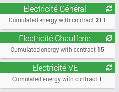

Here is the standard widget.

# FAQ

>**What is the refresh rate?**
>
>The plugin retrieves information every 10 minutes. However, the energy meter sends its readings approximately every 3 hours, so this delay in data retrieval is to be expected.

>**Can I retrieve the gas and water meter readings?**
>
>The plugin is capable of doing this. Unfortunately, the Netatmo API does not specify which "type" to use to retrieve these values. A request has been submitted to the team responsible for developing the API, but no response has been received yet.

# Translation

The interface, log messages, and documentation have been translated into the 5 languages supported by Jeedom (thanks to @mips for developing ga-translation and docs-translations). If you find any translation errors, please open a support ticket and, if possible, attach the corrected translation file (located in the plugin’s core/i18n directory).

# Reviews

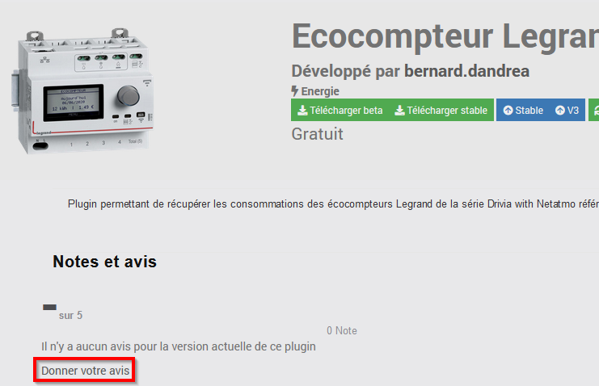

If you like this plugin, please leave a rating and a comment on the Jeedom Market—it’s always appreciated: <https://jeedom.com/market/index.php?v=d&p=market_display&id=4413#>
