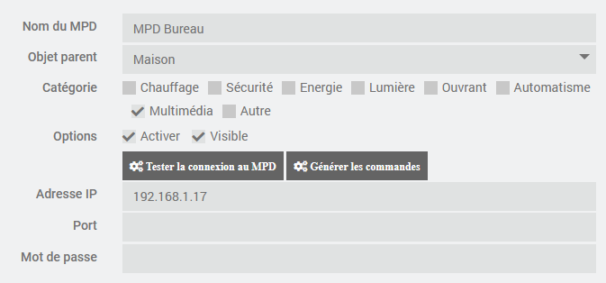
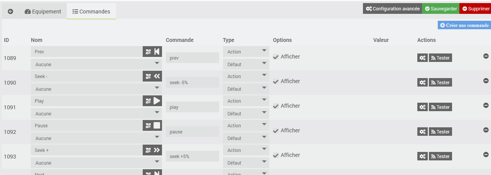
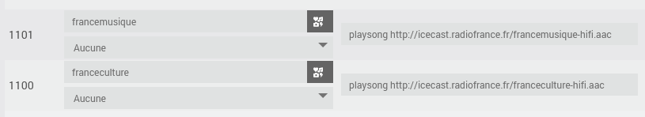
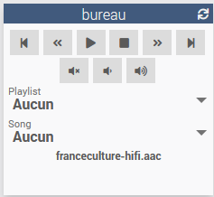
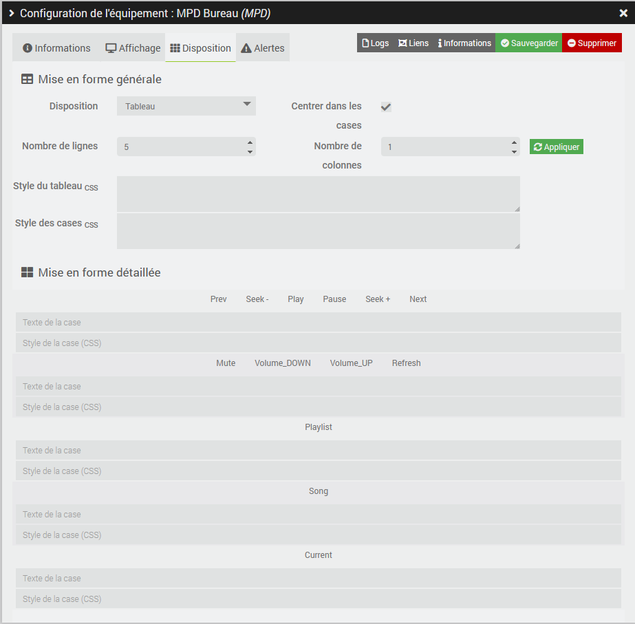
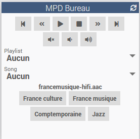
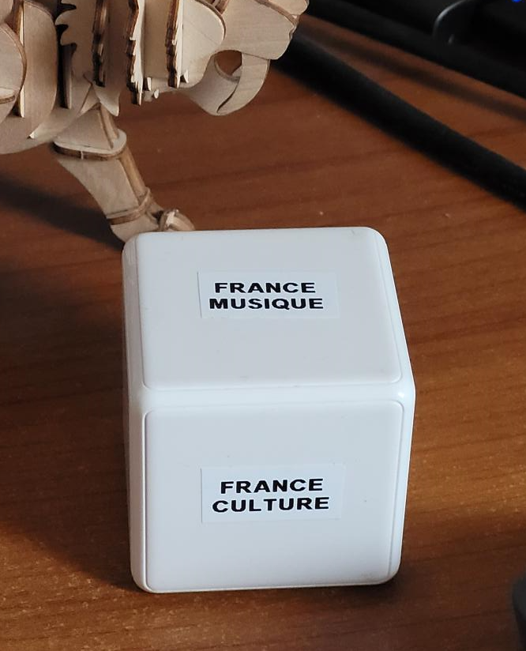
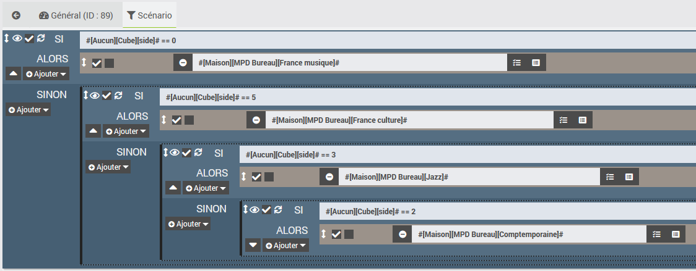
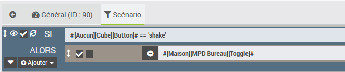
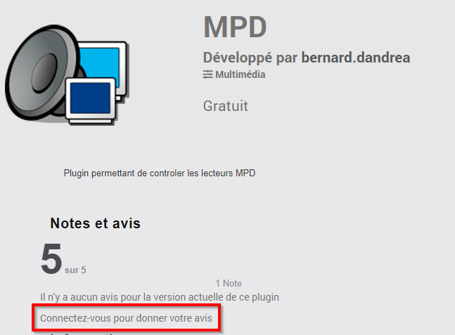

# Complemento MPD

Complemento que permite controlar un reproductor MPD.

Music Player Daemon, o MPD, es un reproductor de audio libre que permite el acceso remoto desde otro ordenador. Se ejecuta en segundo plano en numerosos servidores multimedia como moodeaudio, volumio, etc.

MPD permite reproducir los archivos de audio (= Song) que se encuentran en su cola (= Queue). Esta se alimenta de las listas de reproducción (las listas de reproducción no las gestiona el complemento).

El complemento permite ejecutar las funciones básicas (carga de listas de reproducción, reproducción, volumen, etc.) desde Jeedom. El complemento utiliza la utilidad mpc para ejecutar los comandos en el servidor MPD, tanto si este es local como remoto. El paquete mpc se instala al activar el complemento (enlace de GitHub <https://github.com/MusicPlayerDaemon/mpc>).

# Instalación y configuración del servidor MPD

Para que el complemento funcione correctamente, es necesario que el servidor MPD esté operativo.

Este suele instalarse de forma transparente mediante el servidor multimedia correspondiente (Volumio, Moodeaudio, etc.).

Por defecto, el servidor MPD espera los comandos en el puerto 6600. El acceso al mismo puede controlarse mediante una contraseña.

# Configuración del complemento

Una vez instalado el complemento, hay que activarlo.

Se puede activar el nivel de registro «Debug» para supervisar la actividad del complemento e identificar posibles problemas.

# Configuración de los dispositivos

Se puede acceder a la configuración de los dispositivos desde el menú del complemento (menú Complementos, Multimedia y, a continuación, MPD).

Haz clic en «Añadir» para configurar un nuevo controlador MPD.

Indica la configuración del MPD:

-   **Nombre**: nombre del MPD
-   **Objeto principal**: indica el objeto principal al que pertenece el equipo
-   **Categoría**: indica la categoría de Jeedom del equipo; por defecto, «Multimedia»
-   **Activar**: permite activar el equipo
-   **Visible**: lo muestra en el panel de control
-   **Dirección IP**: IP del servidor MPD; déjalo en blanco si está instalado en el servidor Jeedom
-   **Puerto**: puerto de escucha del servidor MPD; déjalo en blanco si se utiliza el valor por defecto
-   **Contraseña**: contraseña para acceder al servidor MPD

Los siguientes botones permiten realizar las siguientes funciones:

-   **Probar la conexión con el MPD**: permite comprobar si los parámetros de conexión son correctos (no olvides guardar la configuración antes de hacer clic en el botón).
-   **Generar comandos**: permite generar los comandos necesarios para controlar el reproductor (útil únicamente si se ha eliminado alguno de los comandos).

# Comandos asociados a los equipos

Los comandos básicos se generan al crear el equipo.

Para cada comando de tipo «acción», el campo «Comando» (almacenado en el LogicalID del comando Jeedom) indica el comando transmitido a la utilidad mpc. Consulte la documentación de mpc para obtener más información ( <https://www.musicpd.org/doc/mpc/html/> ).

El comando «Crear un comando» permite añadir una acción, por ejemplo, para crear un atajo que reproduzca una emisora de radio. Para ello, se puede utilizar el comando «playsong», que se transformará en «play» seguido del número de la canción en la cola.

# Widget

La presentación predeterminada permite ejecutar las funciones básicas. Fíjate en el botón «refresh» (en la esquina superior derecha del widget), que permite actualizar el estado del reproductor MPD (listas de reproducción, canción en reproducción, etc.). Al seleccionar una lista de reproducción, se inicializa la cola de MPD con las canciones correspondientes. Al seleccionar una canción, se reproduce.

La presentación se realiza mediante la función «Disposición de los equipos» (en «Configuración avanzada»).

Al modificar el diseño, se pueden añadir accesos directos.

# Control del reproductor de audio desde un Mi Cube

Mediante los escenarios, es posible controlar el reproductor de audio sin necesidad de utilizar la interfaz de Jeedom, desde un dispositivo de control como, por ejemplo, el Mi Cube de Xiaomi.

El escenario anterior, que se activa al cambiar el estado de #[Ninguno][Cubo][lado]#, permite cambiar la emisora de radio al cambiar el lado del Mi Cube.

El escenario anterior, que se activa al cambiar el estado de #[Ninguno][Cube][Botón]#, permite detener y reanudar la canción agitando el Mi Cube.

# Traducción

La interfaz, los mensajes que aparecen en los registros y la documentación están traducidos a los cinco idiomas compatibles con Jeedom (gracias a @mips por el desarrollo de ga-translation y docs-translations). Si detectas algún error de traducción, puedes abrir una solicitud de asistencia y, si es posible, adjuntar el archivo de traducción corregido (que se encuentra en el directorio core/i18n del complemento).

# Opiniones

Si te gusta este plugin, te agradeceríamos que dejaras una valoración y un comentario en Jeedom Market, siempre nos hace mucha ilusión: <https://jeedom.com/market/index.php?v=d&p=market_display&id=4464#>
