<!--  
Zuletzt geändert: 28.07.2026, 15:35:23
-->

# OZW-Plugin

Plugin zur Anbindung an SIEMENS-Kommunikationszentralen vom Typ OZW.

Die OZW-Kommunikationszentralen dienen zur Kommunikation mit den Steuerkarten, die zahlreiche Heizkessel, Wärmepumpen und andere industrielle Anlagen steuern. Sie verfügen über einen integrierten Webserver, über den die angeschlossenen Geräte gesteuert werden können.

Es gibt zwei Modelle, die im Wesentlichen gleich funktionieren:

- OZW672 für die Kommunikation mit den Geräten direkt über den LPB- und BSB-Bus
- OZW772 für die Kommunikation mit Geräten über das KNX-Protokoll

Die Kommunikation zwischen dem Plugin und dem OZW erfolgt über die von SIEMENS bereitgestellten WEB-APIs, mit denen sich die Interaktionen simulieren lassen, die normalerweise auf dem Webserver stattfinden.

Dieses Plugin ist eine wesentliche Weiterentwicklung des Plugins OZW672 (siehe https://github.com/NextDom/plugin-ozw672), das nicht mehr gepflegt wird und in der aktuellen Version von Jeedom nicht mehr funktioniert.

# Installation und Konfiguration des OZW-Controllers

Informationen zur Installation der WEB-Kommunikationszentrale finden Sie in der entsprechenden SIEMENS-Dokumentation.

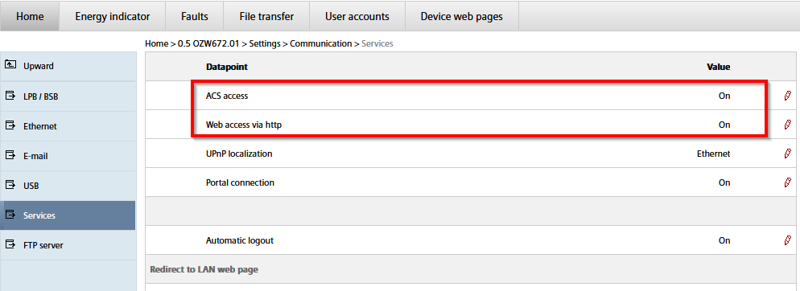

Aktivieren Sie den Zugriff auf die WEB-APIs (Menü „Home“ > 0.5 OZWx72.01 > „Einstellungen“ > „Kommunikation“ > „Dienste“).

Das Plugin wurde mit Version 12 des Webservers getestet. Grundsätzlich sollte das Plugin auch mit früheren Versionen funktionieren, da die API-Aufrufe recht einfach sind und bereits seit vielen Versionen vorhanden sein dürften.

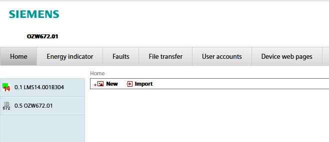

Nach Abschluss der Installation sollte eine Webseite angezeigt werden, die in etwa so aussieht.

In dieser Konfiguration gibt es 2 Geräte:

-   Das erste Bild zeigt eine LMS14-Karte, die einen Heizkessel steuert
-   Das zweite Bild zeigt die Kommunikationszentrale OWZ672 und ermöglicht deren Konfiguration

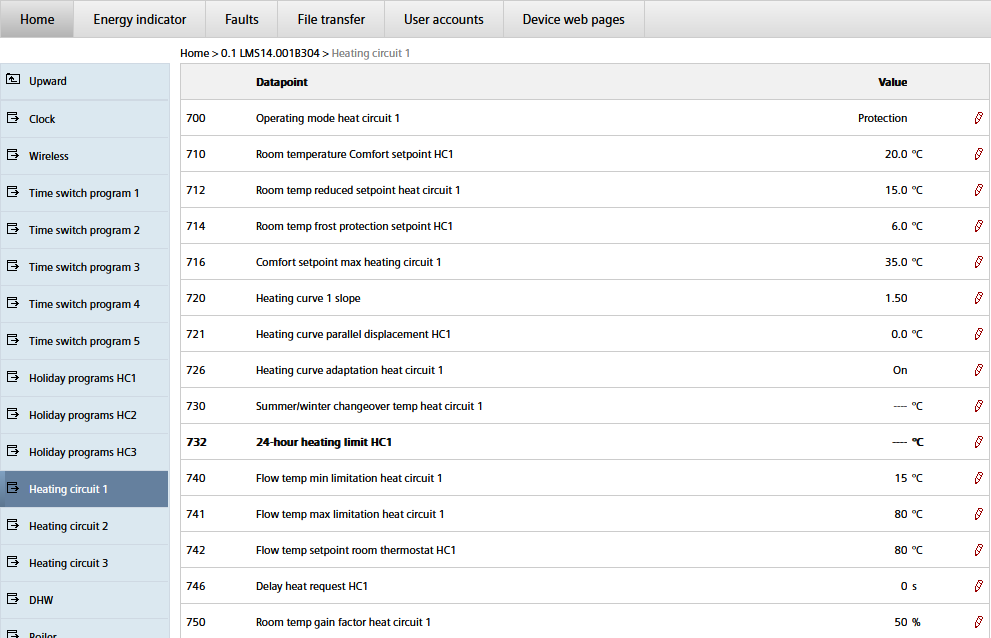

Die verschiedenen für die Karte definierten Datenpunkte sind zugänglich. Sie können eingesehen und gegebenenfalls geändert werden.

In den von SIEMENS bereitgestellten APIs müssen die Datenpunkte über ihre WEB-Referenz angegeben werden, die in der WEB-Oberfläche zu finden ist.

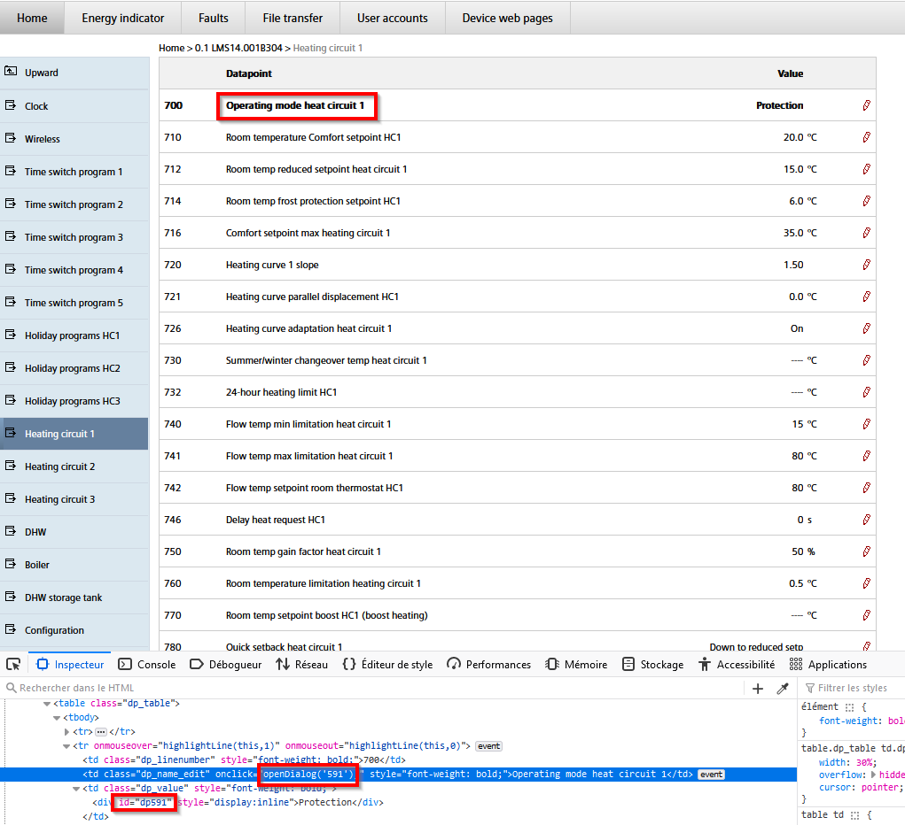

Um sie zu finden, gehen Sie auf die entsprechende Zeile und starten Sie die Elementinspektion (in der Regel Rechtsklick und dann „Inspizieren“). Im entsprechenden Code finden Sie in der Anweisung „openDialog('xxx')“ oder „id='dpxxx'“ eine Nummer, die die WEB-Referenz angibt, im obigen Beispiel ist dies 591.

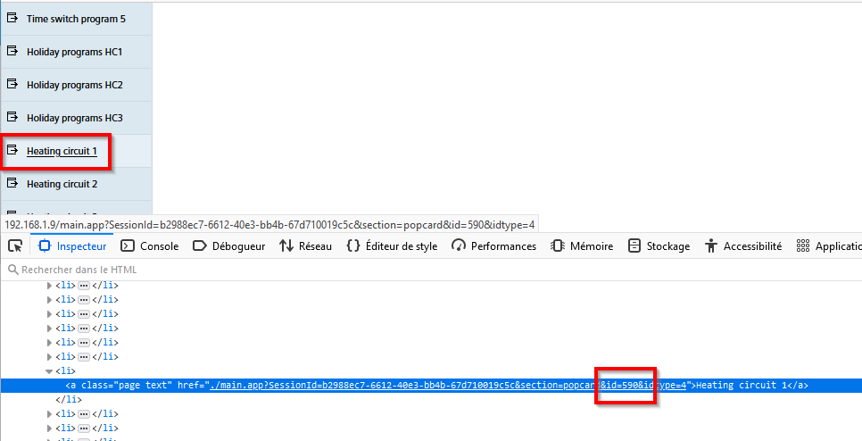

Ebenso kann die ID eines Menüs erforderlich sein; diese lässt sich auf dieselbe Weise ermitteln – im obigen Beispiel ist es 590.

# Einrichtung des Plugins

Sobald das Plugin installiert ist, muss es aktiviert werden.

Sie können außerdem festlegen, ob ein eigenständiger Cron-Job verwendet wird. Dadurch werden andere Cron-Jobs nicht blockiert, falls der Cron-Job des Plugins abstürzt, und das Plugin selbst wird nicht durch andere Cron-Jobs blockiert, die für andere Plugins gestartet werden.

Sie können die Debug-Protokollstufe aktivieren, um die Aktivität des Plugins zu verfolgen und eventuelle Probleme zu identifizieren.

# Konfiguration der Geräte

Die Konfiguration der Geräte erfolgt über das Plugin-Menü (Menü „Plugins“, „Verbundene Objekte“ und dann „OZW“).

Klicken Sie auf „Hinzufügen“, um die OZW festzulegen.

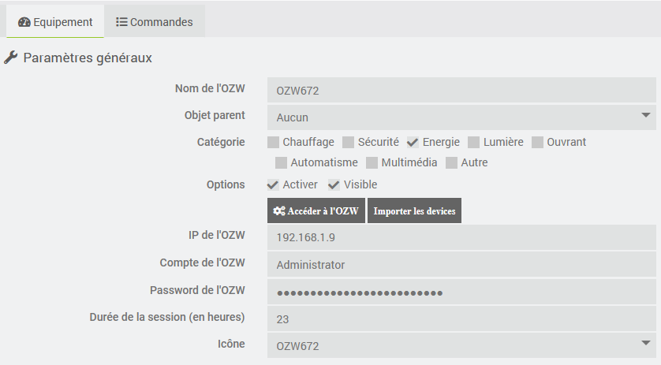

Geben Sie die Konfiguration des OZW an:

-   **Name**: Name der OZW
-   **Übergeordnetes Objekt**: Gibt das übergeordnete Objekt an, zu dem das Gerät gehört
-   **Kategorie**: Gibt die Jeedom-Kategorie des Geräts an
-   **Aktivieren**: Damit wird das Gerät aktiviert.
-   **Sichtbar**: Macht es auf dem Dashboard sichtbar
-   **IP-Adresse**: IP-Adresse des Geräts
-   **Benutzername und Passwort**: Zugangsdaten für den Webserver
-   **Dauer einer Sitzung**: Zeitraum, nach dessen Ablauf die Sitzungs-ID erneuert wird
-   **Symbol**: Ermöglicht die Auswahl eines Symboltyps für das Gerät in der Systemsteuerung

Nachdem Sie die OZW gespeichert haben, sind die folgenden Schaltflächen aktiv:

-   **Zugriff auf das OZW**: Ermöglicht die Anmeldung über das Web beim OZW
-   **Geräte importieren**: Ermöglicht den Import der Geräte, die mit dem OZW verbunden sind.

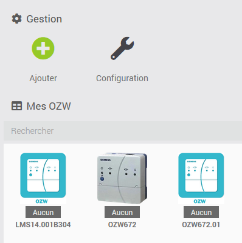

Im obigen Beispiel findet man nach dem Import der Geräte Folgendes:

- das OZW672 als Hauptgerät
- das OZW672.01 als Gerät
- die LMS14-Karte zur Steuerung des Heizkessels

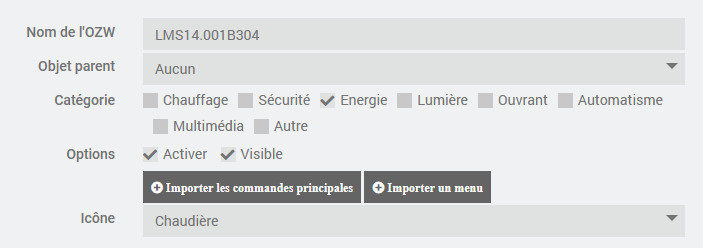

Es ist möglich, dem Gerät ein bestimmtes Symbol zuzuweisen. Man kann auch ein benutzerdefiniertes Symbol anpassen, indem man das entsprechende Bild (z. B. perso1.png für das Symbol „perso1“) im Verzeichnis „plugin_info“ des Plugins hinzufügt.

# Gerätebezogene Steuerungen

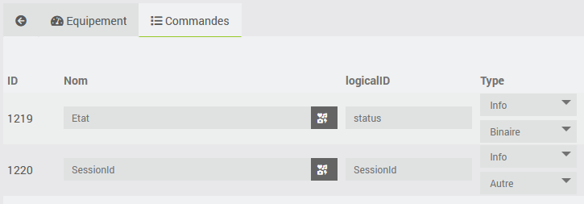

Für das OZW werden zwei Befehle vom Typ „info“ erstellt:

- Status: 1, wenn die Verbindung zum Webserver hergestellt ist, andernfalls 0
- SessionID: Von den Web-APIs verwendete ID

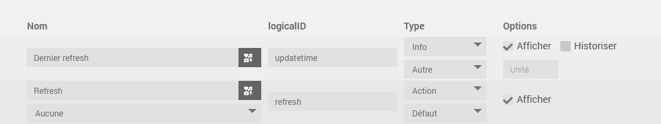

Für die an das OZW angeschlossenen Geräte werden zwei Befehle erstellt:

- Letzte Aktualisierung: Info-Befehl, der angibt, wann die letzten Informationen des Geräts aktualisiert wurden
- Refresh: Ein Befehl vom Typ „Aktion“, mit dem alle Datenpunkte aktualisiert werden können, für die die Aktualisierung aktiviert ist

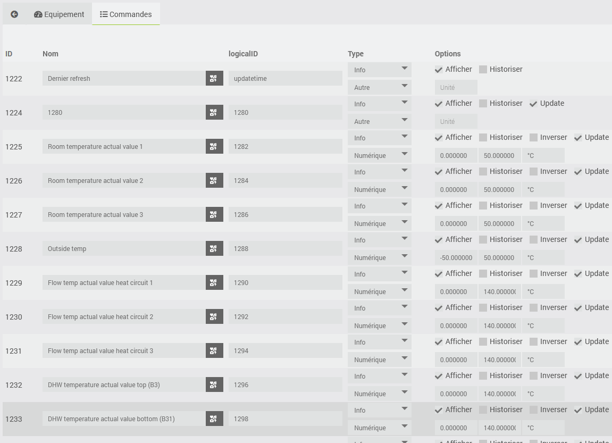

Über die Schaltfläche „Hauptbefehle importieren“ auf der Registerkarte „Ausstattung“ können alle Datenpunkte aus dem Menü „Mobil“ importiert werden. Dieses Menü ist in der von SIEMENS bereitgestellten Android-App enthalten und steht nicht für alle Geräte zur Verfügung. Das Erstellen der Befehle kann mehrere Minuten dauern. Nach der Ausführung werden die wichtigsten Datenpunkte des Geräts als Befehle vom Typ „Info“ angezeigt.

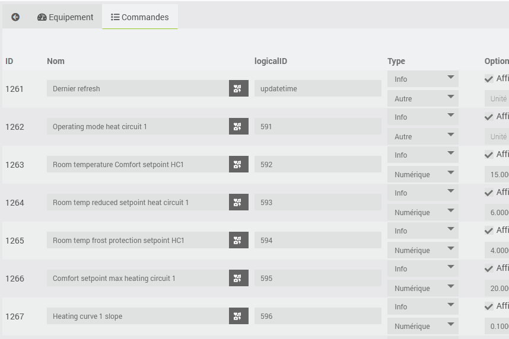

Ebenso ermöglicht die Schaltfläche „Menü importieren“ auf der Registerkarte „Ausstattung“ den Import aller Datenpunkte eines bestimmten Menüs. Dazu muss die WEB-Referenz des Menüs angegeben werden.

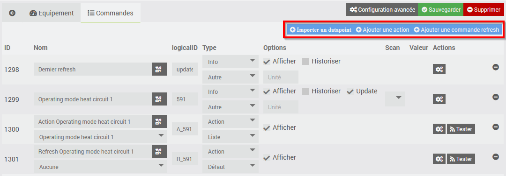

Auf der Registerkarte „Befehle“ stehen folgende Schaltflächen zur Verfügung:

- Datenpunkt importieren: Ermöglicht die Erstellung eines Info-Befehls für einen bestimmten Datenpunkt
- Aktion hinzufügen: Ermöglicht es, den Wert des Datenpunkts zu ändern (sofern dies auf dem Webserver zulässig ist)
- Befehl „refresh“ hinzufügen: Ermöglicht das erzwungene Abrufen des Werts des Datenpunkts

**Achtung**: Geben Sie bitte unbedingt die WEB-Referenz des Datenpunkts an und nicht die in der Datenpunktzeile angezeigte Zeilennummer.

# Analyse der Bestellfelder

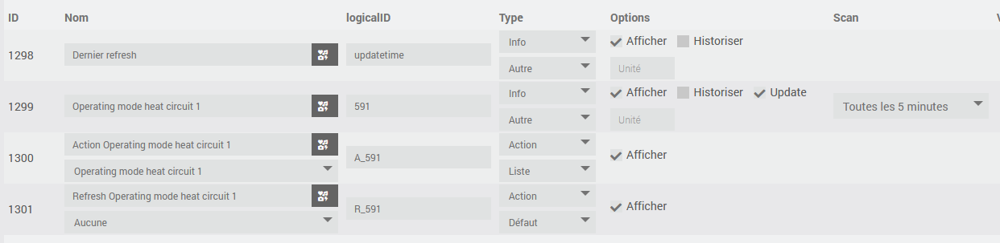

Für jeden Befehl, der sich auf einen Datenpunkt bezieht, gibt es zusätzlich zu den üblichen Jeedom-Feldern:

- die LogicalID:
  - für Befehle vom Typ „info“, entspricht der WEB-Referenz des Datenpunkts
  - für Aktionsbefehle, gleich „A_“, gefolgt von der WEB-Referenz des Datenpunkts
  - Bei Refresh-Befehlen entspricht dies „R_“, gefolgt von der WEB-Referenz des Datenpunkts
- Das Kontrollkästchen „Update“, mit dem festgelegt werden kann, ob eine Aktualisierung des Datenpunkts angefordert werden soll oder nicht
- Das Feld „scan“, das die Aktualisierungsfrequenz des Datenpunkts angibt

# Widget

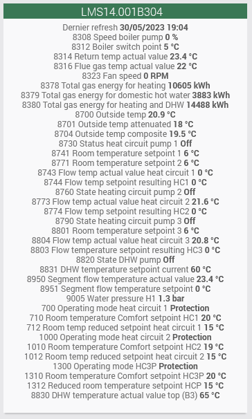

Hier ist ein Beispiel für ein Widget. Die Namen der Befehle können so geändert werden, dass sie der im Webserver angegebenen Zeilennummer entsprechen.

# Übersetzung

Die Benutzeroberfläche, die in den Protokollen ausgegebenen Meldungen und die Dokumentation sind in die fünf von Jeedom unterstützten Sprachen übersetzt (vielen Dank an @mips für die Entwicklung von ga-translation und docs-translations). Sollten Sie Übersetzungsfehler feststellen, können Sie eine Supportanfrage stellen und, wenn möglich, die korrigierte Übersetzungsdatei (im Verzeichnis core/i18n des Plugins) beifügen.

# Bewertungen

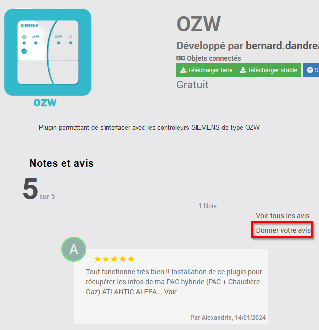

Wenn Ihnen dieses Plugin gefällt, hinterlassen Sie bitte eine Bewertung und einen Kommentar im Jeedom Market – das freut uns immer: <https://jeedom.com/market/index.php?v=d&p=market_display&id=4414#>
