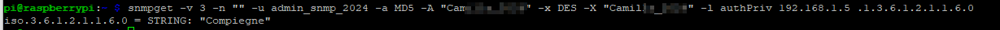
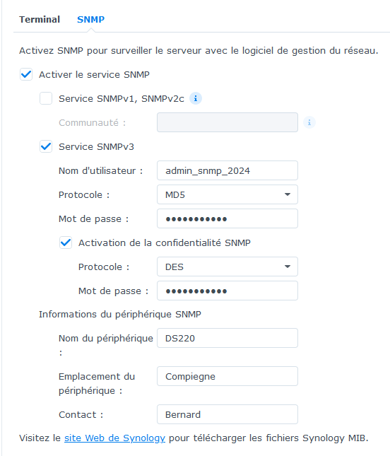
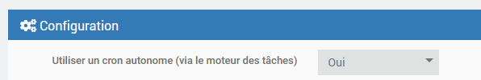
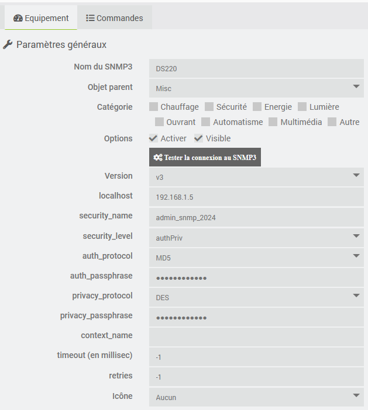
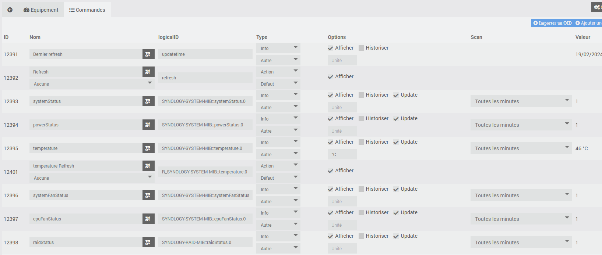
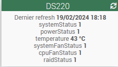
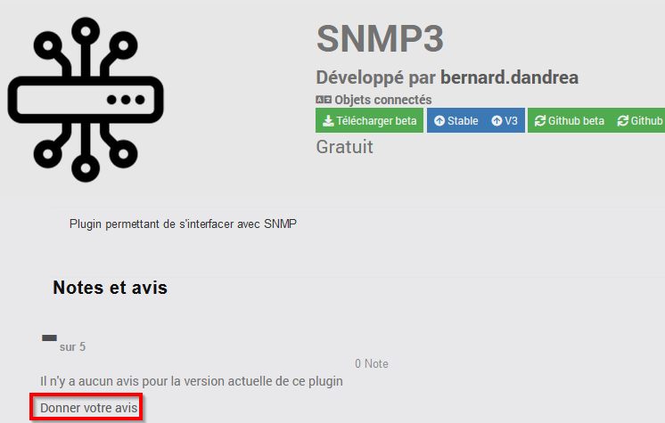

<!--  
Última modificación: 25/07/2026 18:39:50
-->

# Complemento SNMP3

Complemento que permite leer y escribir los OID de los dispositivos compatibles con el protocolo SNMP.

SNMP es uno de los protocolos más utilizados para gestionar y analizar los dispositivos de red. La mayoría de los dispositivos de red de calidad profesional incorporan un agente SNMP integrado.

El complemento utiliza el paquete php-snmp (véase <https://www.php.net/manual/fr/book.snmp.php>), que es una envoltura de la biblioteca Net-SNMP (véase <http://www.net-snmp.org>). El complemento permite consultar (comando «get») y actualizar (comando «set») los OID que lo admiten.

# ADVERTENCIA

Este complemento está dirigido a personas que estén familiarizadas con el protocolo.

Este tema no es especialmente complicado, pero sí requiere dominar los conceptos en los que se basa (autenticación, OID, MIB, etc.).

Antes de ponerse en contacto con el desarrollador por cualquier problema, compruebe primero que los parámetros de comunicación con el dispositivo SNMP sean correctos.

Para ello, se puede utilizar, por ejemplo, el comando snmpget en una sesión SSH:

snmpget -v 3 -n "" -u admin_snmp_2024 -a MD5 -A "xxxxxx" -x DES -X "yyyyy" -l authPriv 192.168.1.5 .1.3.6.1.2.1.1.6.0

# Instalación y configuración de dispositivos SNMP

Para que el complemento funcione correctamente, es necesario que el protocolo SNMP esté correctamente instalado y configurado en el sistema de destino. Consulte la documentación del fabricante para realizar esta configuración.

Se recomienda utilizar el protocolo v3 para garantizar la seguridad de la conexión.

Arriba puedes ver un ejemplo de configuración en un NAS de Synology.

Comprueba los parámetros de conexión con el comando snmpget (véase el apartado anterior) u otras utilidades.

# Configuración del complemento

Una vez instalado el complemento, hay que activarlo. El paquete php-snmp se instala al instalar las dependencias.

Puedes activar el nivel de registro «Debug» para realizar un seguimiento de la actividad del complemento e identificar posibles problemas.

También puedes configurar si se utiliza un cron independiente. Esto permite que, si el cron del plugin se bloquea, no se bloqueen los demás crons, y que el plugin no se vea bloqueado por otros crons ejecutados por otros plugins.

# Gestión de MIB

Los OID se pueden identificar mediante su código numérico, por ejemplo, .1.3.6.1.4.1.6574.1.1.0, o utilizando la MIB correspondiente, por ejemplo, SYNOLOGY-SYSTEM-MIB::systemStatus.0.

Al instalar el paquete php-snmp, se instalan varios MIB (normalmente en el directorio /usr/share/snmp/mibs) que se pueden utilizar directamente.

El complemento permite instalar MIB específicas colocando los archivos correspondientes, por ejemplo, SYNOLOGY-SYSTEM-MIB.txt, en el directorio plugins/SNMP3/data/mibs.

También puedes copiar los archivos en el directorio común (normalmente /usr/share/snmp/mibs). Ten en cuenta que tendrás que repetir este proceso en caso de que se restaure Jeedom.

Si tienes dificultades para implementar los MIB, puedes probarlos con el comando snmptranslate (consulta <https://net-snmp.sourceforge.io/tutorial/tutorial-5/commands/snmptranslate.html>). Atención: en este caso, no se tienen en cuenta los MIB del directorio plugins/SNMP3/data/mibs.

# Configuración de los dispositivos

Se puede acceder a la configuración de los dispositivos desde el menú del complemento (menú Complementos, Objetos conectados y, a continuación, SNMP3).

Haz clic en «Añadir» para configurar el dispositivo SNMP.

Indica la configuración del dispositivo SNMP:

-   **Nombre**: nombre del dispositivo SNMP
-   **Objeto principal**: indica el objeto principal al que pertenece el equipo
-   **Categoría**: indica la categoría de Jeedom del equipo
-   **Activar**: permite activar el equipo
-   **Versión**: versión de SNMP
-   **localhost**: IP del dispositivo
-   **Parámetros de seguridad**: véase <https://www.php.net/manual/fr/snmp.setsecurity.php>
-   **tiempo de espera**: tiempo máximo durante el cual se espera una respuesta a la solicitud SNMP
-   **reintentos**: número de veces que se envía la orden en caso de fallo (3 si el campo está vacío)
-   **Icono**: permite seleccionar un tipo de icono para el dispositivo en el panel de configuración

Es posible personalizar un icono específico añadiendo la imagen correspondiente (por ejemplo, perso1.png para el icono perso1) en el directorio plugin_info del complemento.

El botón **Probar la conexión a SNMP3** permite comprobar si los parámetros de conexión son correctos (recuerda encender el equipo y guardar la configuración antes de hacer clic en el botón).

# Comandos asociados a los equipos

Por defecto, se crean dos comandos:

- Última actualización: comando de información que indica cuándo se actualizó por última vez la información del dispositivo SNMP
- Refresh: comando de acción que permite actualizar todos los OID para los que la actualización está activada

Están disponibles los siguientes botones:

- Importar un OID: permite crear un comando de información para un OID
- Añadir un comando «refresh»: permite crear un comando de acción para forzar la recuperación del valor del OID
- Añadir una acción: permite crear un comando de acción para modificar el valor del OID (cuando lo permita el dispositivo SNMP)

# Análisis de los campos del pedido

Para cada comando relacionado con un OID, además de los campos habituales de Jeedom, se encuentran:

- el LogicalID:
  - para comandos de tipo «info», igual al OID
  - para los comandos de actualización, igual a «R_» seguido del OID
  - para los comandos de acción, igual a «A_» seguido del OID
- la casilla de actualización que permite solicitar o no la actualización del OID
- el campo «scan», que indica la frecuencia de actualización del OID

En el caso de los comandos que permiten actualizar el OID, el subtipo del comando de acción determina el formato del valor transmitido al dispositivo SNMP. Cuando el subtipo es «Message», el título indica el formato y el contenido del mensaje proporciona el valor (solo se transmite la primera línea). Consulte <https://www.php.net/manual/fr/function.snmpset.php> para ver los formatos compatibles.

# Widget

Este es un ejemplo de widget. Se puede modificar el nombre de los comandos para que sean más descriptivos.

# Traducción

La interfaz, los mensajes que aparecen en los registros y la documentación están traducidos a los cinco idiomas compatibles con Jeedom (gracias a @mips por el desarrollo de ga-translation y docs-translations). Si detectas algún error de traducción, puedes abrir una solicitud de asistencia y, si es posible, adjuntar el archivo de traducción corregido (que se encuentra en el directorio core/i18n del complemento).

# Opiniones

Si te gusta este plugin, te agradeceríamos que dejaras una valoración y un comentario en Jeedom Market, siempre nos hace mucha ilusión: <https://jeedom.com/market/index.php?v=d&p=market_display&id=4484#>
