<!--  
Ultima modifica: 26/06/2026
-->
- [La gestione dei dati storici in Jeedom](#la-gestione-dei-dati-storici-in-jeedom)
  - [Funzionamento](#funzionamento)
  - [Volume dei dati storici](#volume-dei-dati-storici)
  - [I limiti dell'archiviazione in Jeedom](#i-limiti-dell'archiviazione-in-jeedom)
  - [I vantaggi del plugin archiplus](#i-vantaggi-del-plugin-archiplus)
  - [Avviso](#avviso)
- [Plugin archiplus](#plugin-archiplus)
  - [Installare il plugin archiplus](#installare-il-plugin-archiplus)
  - [Configurare il plugin](#configurare-il-plugin)
  - [I moduli del plugin](#i-moduli-del-plugin)
- [Accesso ai moduli](#accesso-ai-moduli)
  - [I pulsanti di comando](#i-pulsanti-di-comando)
  - [La colonna di selezione delle righe](#la-colonna-di-selezione-delle-righe)
  - [Le intestazioni delle colonne](#le-intestazioni-delle-colonne)
  - [Le linee](#le-linee)
  - [I totali in fondo alla tabella](#i-totali-in-fondo-alla-tabella)
- [il modulo Monitor](#il-modulo-monitor)
  - [Statistiche](#statistiche)
  - [Visualizzazione](#visualizzazione)
  - [Modifiche](#modifiche)
  - [Modifiche da un file Excel](#modifiche-da-un-file-excel)
  - [Dati modificabili](#dati-modificabili)
    - [KLV (Keep Last Value)](#klv-keep-last-value)
    - [Uniq](#uniq)
    - [Scadenza](#scadenza)
    - [Inquadramento](#inquadramento)
    - [Pond](#pond)
    - [Pacchetto](#pack)
    - [Arrotondato](#arrotondato)
  - [Funzioni accessibili tramite il menu contestuale](#funzioni-accessibili-tramite-il-menu-contestuale)
- [Dati storici](#dati-storici)
  - [Accesso](#accesso)
  - [Modifica](#modifica)
  - [Eliminazione](#eliminazione)
  - [Esporta](#export)
- [Il modulo Import](#il-modulo-import)
- [Il modulo Restore](#il-modulo-restore)
- [Domande frequenti](#faq)
  - [Mantieni l'ultimo valore](#keep-last-value)
  - [Uniq](#uniq-1)
  - [Tempistiche e definizione dell'ambito](#tempistiche-e-definizione-dell'ambito)
  - [Smoothing e ponderazione](#smoothing-e-ponderazione)
  - [Pacchetto](#pack-1)
  - [Arrotondato](#arrotondato-1)
  - [Copiare i dati da historyArch a history](#copiare-i-dati-da-historyarch-a-history)
  - [Utilizzo di Archiplus in PHP](#utilizzare-archiplus-in-php)
- [I log](#i-log)
- [Traduzione](#traduzione)
- [Recensioni](#recensioni)

La funzione principale del plugin è quella di fornire una serie completa di strumenti che consentono di:

*   **gestire le impostazioni di archiviazione dei comandi di tipo INFO**
*   **visualizzare i volumi di dati e rilevare le anomalie**
*   **inserire facilmente dati storici da file di tipo Excel**
*   **recuperare i dati storici dagli archivi Jeedom**
*   **ampliare le opzioni di archiviazione standard di Jeedom**

L'attivazione opzionale dell'archiviazione integrata nel plugin consente di ampliare in modo significativo le funzioni di archiviazione offerte da Jeedom.

# La gestione degli storici in Jeedom

## Funzionamento

La cronologia in Jeedom è rimasta pressoché invariata rispetto alle prime versioni e si basa su due tabelle:

* la tabella history che riceve gli aggiornamenti dei valori dei comandi di tipo INFO per i quali è attivata la cronologia
* la tabella historyArch che riceve ad ogni archiviazione (di solito ogni giorno alle 5:00) i valori di history consolidati o meno, a seconda delle impostazioni definite per il comando.

La struttura delle due tabelle è identica e molto semplice: per ogni comando viene registrato un valore con ID e data/ora (con precisione al secondo).

La cronologia può essere visualizzata nell'interfaccia Jeedom sotto forma di grafico.

La documentazione ufficiale relativa alla gestione degli storici in Jeedom è disponibile [qui](https://doc.jeedom.com/fr_FR/core/4.5/history).

## Volume dei dati storici

L'utente di Jeedom inizierà a interessarsi alla cronologia quando noterà che il database sta crescendo in modo eccessivo, che i tempi di visualizzazione della cronologia stanno diventando molto lunghi e che la dimensione dei backup continua ad aumentare.

Il seguente link rimanda a un tutorial che spiega come creare uno scenario che elenchi i volumi delle tabelle più grandi e i comandi INFO con gli storici più estesi [Tutorial - Analisi degli archivi](https://community.jeedom.com/t/tuto-analyser-les-archives-pour-detecter-des-pbs-lenteurs-espaces-disques/104384).

In parole povere, è possibile visualizzare i volumi delle tabelle interrogando direttamente il database (menu Impostazioni / Sistema / Configurazione, quindi scheda OS / DB (l'ultima), poi il pulsante "Amministrazione database" (il pulsante rosso più in basso) e infine, a sinistra, l'opzione "dimensione").

In un impianto standard, è necessario iniziare a riflettere quando il volume complessivo degli archivi supera il milione di registrazioni o quando un comando "info" restituisce più di 10.000 registrazioni. In tal caso, è necessario analizzare i comandi in questione e regolare i diversi parametri di registrazione e archiviazione al fine di ridurre tale volume. Se ciò non fosse possibile, potrebbe essere necessario ricorrere ad altri metodi di archiviazione, ad esempio InfluxDB, che può interfacciarsi di serie con Jeedom.

Il plugin archiplus fornisce immediatamente i volumi di history e historyArch e consente di individuare facilmente i problemi e di risolverli.

## I limiti dell'archiviazione in Jeedom

Sebbene in molti impianti il funzionamento standard sia sufficiente, si possono riscontrare le seguenti limitazioni:

* Difficoltà nel visualizzare e modificare le impostazioni di archiviazione: l'unico strumento disponibile (menu Analisi / Cronologia, quindi Configurazione) è molto lento, poco pratico e presenta pochi campi da configurare
* Difficoltà nel visualizzare i volumi storici per ordine e nell'individuare i volumi anomali: è necessario ricorrere a query SQL e a procedure poco pratiche
* Impostazioni per il raggruppamento dei dati in historyArch definite a livello globale e non personalizzabili per singolo comando
* Mancanza di visibilità sul processo di archiviazione (assenza di log)
* Archiviazione globale: non è possibile avviare l'archiviazione per un ordine specifico
* Lisciamento approssimativo tramite media
* Strumenti di base per esportare/importare i dati (plugin dataexport). Non è prevista alcuna funzionalità per ripristinare i dati storici contenuti nei backup.

## I VANTAGGI del plugin archiplus

Il plugin archiplus consente di visualizzare in una tabella i comandi di tipo INFO con tutti i parametri relativi all'archiviazione. Viene inoltre indicato il numero di record presenti in history e historyArch, il che permette di individuare con estrema facilità volumi eccessivi. Il plugin utilizza la libreria javascript Tabulator, estremamente performante e che consente un accesso molto semplice alle funzioni del plugin.

Tutte le funzioni offerte da Jeedom sono disponibili direttamente e ne sono state aggiunte altre:

* Configurazione avanzata del comando
* Visualizzazione dei grafici ed estrazione dei dati
* Cancellazione della cronologia
* Esportazione CSV standard
* Copia della configurazione dello storico (o di un singolo parametro) su più comandi
* Caricamento delle impostazioni dei comandi INFO relativi alla cronologia da un file Excel
* Avvio dell'archiviazione per un determinato ordine
* Copia della cronologia di un ordine in un altro ordine
* Copia di historyArch in history per avviare un consolidamento a intervalli
* Importazione della cronologia di un ordine da un file Excel
* Estrazione della cronologia in diversi formati (xlsx, CSV, JSON, HTML) di uno o più comandi da Jeedom o da un backup standard di Jeedom
* Estrazione da un backup Jeedom dei parametri dei comandi INFO relativi alla cronologia (questi parametri possono poi essere applicati su Jeedom)

Inoltre, è possibile attivare il processo di archiviazione del plugin in sostituzione della funzione di archiviazione nativa offerta da Jeedom. Ciò consente di:

* avviare l'archiviazione per un determinato ordine
* registrare nel log Archiplus tutte le operazioni effettuate e i parametri considerati per ogni comando
* personalizzare il periodo di calcolo (per min, max, media), il tempo di attesa prima dell'archiviazione e la dimensione del pacchetto per ogni comando
* impostare la data di pulizia su un giorno, un'ora o un minuto
* avviare l'archiviazione di un ordine da uno scenario (in codice PHP)
* per aggiungere opzioni non previste in Jeedom (vedere le spiegazioni più avanti nella documentazione)
  * Keep Last Value: conservare sempre almeno un valore nella cronologia
  * Uniq: eliminare i valori identici consecutivi in historyArch
  * Ponderazione: nel livellamento tramite media, calcolare il valore ponderato sull'intervallo di tempo (e non la media dei valori)

Il plugin archiplus è stato sviluppato su Debian 12 e non utilizza jQuery (così come le librerie di terze parti impiegate). Rispetta gli standard di sviluppo di Jeedom. Il codice della classe archiplus è molto strutturato e ampiamente documentato: l'autore del plugin valuterà attentamente tutte le proposte di correzione o miglioramento.

Poiché Jeedom non ha in programma di sviluppare ulteriormente la gestione della cronologia, il plugin non dovrebbe richiedere una revisione nel prossimo futuro.

## Avviso

Il plugin e il suo specifico processo di archiviazione sono stati sottoposti a test molto rigorosi, ma non sono comunque esenti da anomalie. In tal caso, il team Jeedom non è ovviamente tenuto a fornire assistenza. Le richieste di analisi e correzione dovranno essere indirizzate obbligatoriamente all'autore del plugin tramite la richiesta di assistenza standard.

L'attivazione del plugin e, in particolare, del processo di archiviazione implicano quindi la piena accettazione di questa situazione.

# Plugin Archiplus

## Installare il plugin archiplus

Accedere al Market Jeedom, cercare il plugin archiplus e installare la versione **stabile**. Quindi **attivare il plugin**.

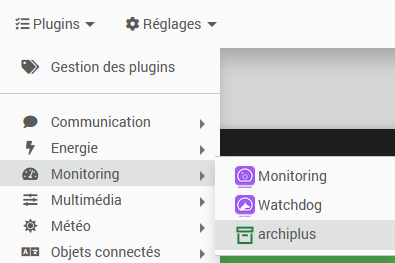

Il plugin è accessibile tramite il menu.

## Configurare il plugin

Nella configurazione è possibile impostare i parametri standard dei plugin e i valori predefiniti del plugin.

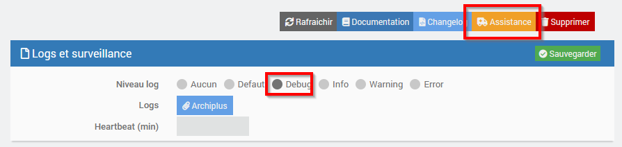

Per ottenere il massimo delle informazioni sul processo di archiviazione del plugin e sulle azioni eseguite, si consiglia di impostare i log in modalità Debug.

Si prega di notare che le richieste di assistenza dovranno essere inviate tramite il pulsante **Assistenza**.

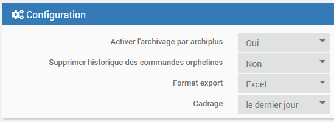

Nella sezione "Configurazione" è possibile:

* Attiva l'archiviazione specifica (disattivata per impostazione predefinita)
* Specificare se le voci presenti in history e historyArch devono essere eliminate nel caso in cui il comando in questione non esista
* Scegliere di non trasferire le registrazioni della cronologia in historyArch quando non è presente alcuna livellatura
* Definire il formato per le esportazioni
* Definire l'intervallo predefinito per le date di eliminazione e di fine archiviazione

L'attivazione dell'archiviazione specifica crea un nuovo cron nel motore delle attività e disattiva l'archiviazione standard. La disattivazione dell'archiviazione specifica esegue l'operazione inversa.

Se desiderate testare il processo di archiviazione del plugin, potete attivarlo temporaneamente, eseguire dei test di archiviazione su singoli comandi e poi disattivare l'archiviazione del plugin. Poiché il processo di archiviazione di Jeedom viene solitamente avviato alle 5 del mattino, non ci saranno ripercussioni sui comandi non testati.

## I moduli del plugin

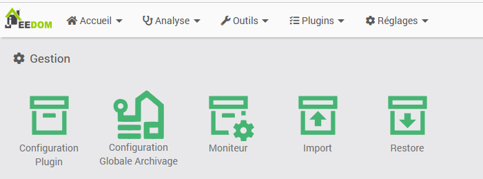

Dal menu Plugins / Monitoring / archiplus è possibile accedere a tutte le funzioni del plugin

* Configurazione del plugin (vedi sopra)
* Accesso alle impostazioni generali della configurazione dell'archiviazione
* Monitoraggio: visualizzare e modificare le impostazioni ed eseguire le principali operazioni relative all'archiviazione
* Importazione: importare dati storici da un file in formato Excel
* Ripristino: estrazione dei dati storici da un archivio standard Jeedom

La visualizzazione dei dati storici è accessibile dal modulo Monitoring e Restore.

# Accesso ai moduli

I moduli vengono avviati dalla configurazione del plugin.

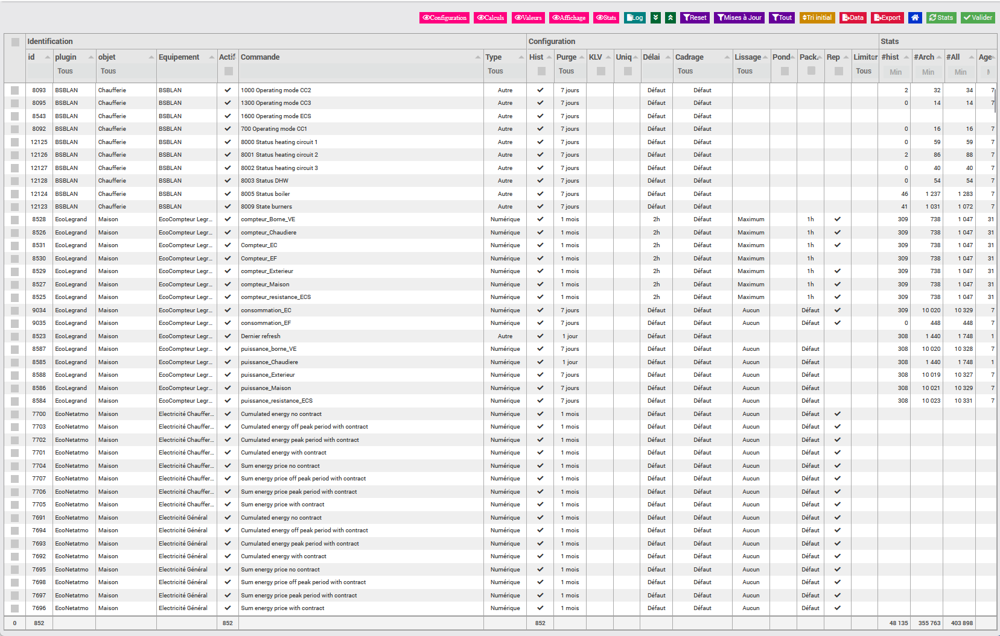

La base dell'interfaccia è una tabella Tabulator compilata con i dati pertinenti.

Ad esempio, con il modulo Monitor, viene visualizzata una tabella con i comandi di tipo INFO per i quali è attivata la funzione cronologica.

Lo schermo è composto da diverse parti.

## I pulsanti di comando

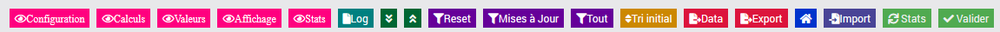

I pulsanti consentono di eseguire azioni generali relative alla visualizzazione, alle righe selezionate, agli aggiornamenti, ecc.

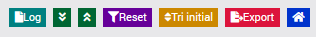

I pulsanti sopra riportati sono comuni a tutti i moduli e consentono di:

* visualizzare il file di log di Archiplus
* per passare alla prima o all'ultima riga della tabella
* disattivare i filtri che sono stati attivati
* tornare alla selezione iniziale
* esportare i dati visualizzati nella tabella (solo i dati filtrati)
* per tornare ai diversi moduli offerti da Archiplus

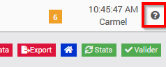

Il pulsante standard "Aiuto sulla pagina corrente" consente di accedere alla documentazione del plugin.

## La colonna di selezione delle righe

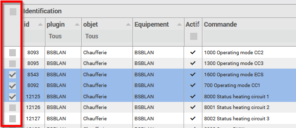

La prima colonna consente di selezionare le righe su cui si desidera intervenire.

Cliccando sull'intestazione della colonna, si selezionano tutte le righe visualizzate nella tabella.

È possibile selezionare ogni riga singolarmente cliccando sulla casella di selezione o in qualsiasi punto della riga.

È possibile selezionare anche una serie di righe cliccando sulla prima riga da selezionare tenendo premuto il tasto Ctrl, quindi cliccando sull'ultima riga sempre tenendo premuto il tasto Ctrl (attenzione a cliccare in un punto qualsiasi della riga, ma non sulla casella di selezione, altrimenti la selezione multipla non funzionerà).

## Le intestazioni delle colonne

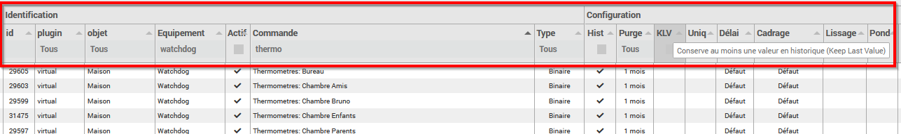

Le intestazioni delle colonne descrivono il contenuto delle celle presenti nella colonna.

Consentono di:

* ottenere ulteriori informazioni tramite un tooltip lasciando il mouse per un secondo sul campo
* ordinare le righe in base al valore del campo cliccando sull'intestazione della colonna (si noti che il pulsante "Ordina inizialmente" consente di annullare tutti gli ordinamenti effettuati)
* filtrare le righe visualizzate inserendo un criterio di selezione nel campo situato sotto il nome della colonna (si noti che il pulsante "Reset" consente di annullare tutte le selezioni).

Nel caso del modulo Monitor, raggruppando le colonne è possibile selezionare solo determinati tipi di informazioni.

## Le linee

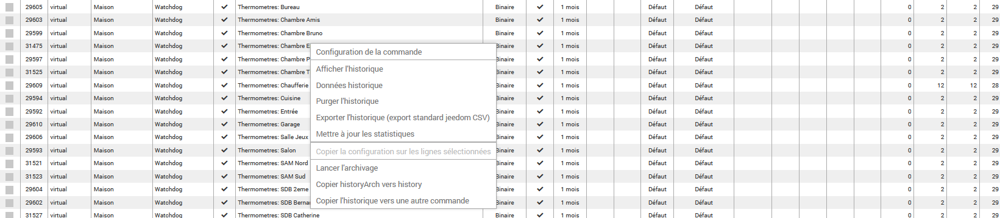

Le righe riportano le informazioni richieste.

A seconda del contesto, cliccando con il tasto destro del mouse si apre un menu contestuale con le azioni disponibili.

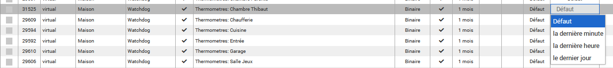

Cliccando su un campo modificabile, è possibile inserire un nuovo valore.

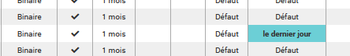

I campi modificati vengono evidenziati su uno sfondo magenta che scompare dopo la conferma delle modifiche.

## I totali in fondo alla tabella

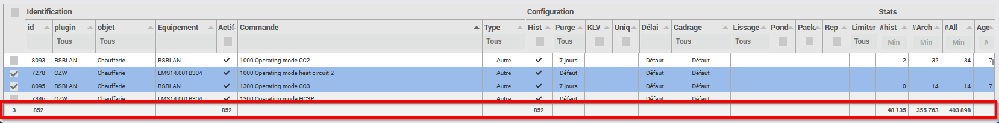

Nella parte inferiore della tabella vengono visualizzati i totali corrispondenti alle righe visualizzate o selezionate.

# il modulo Monitor

Si tratta del modulo principale di archiplus.

Dopo aver cliccato su Monitor, i comandi INFO con una cronologia attiva vengono visualizzati in pochi secondi.

Cliccando sul pulsante qui sopra, è possibile passare alla visualizzazione di tutti i comandi INFO, anche quelli che non richiedono la cronologia o quelli relativi ad apparecchiature inattive.

## Statistiche

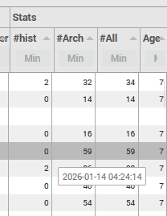

Il numero di registrazioni in history e historyArch corrisponde generalmente a quello dell'ultimo archiviazione (è possibile visualizzare la data di aggiornamento passando il mouse su uno dei contatori). Cliccando sull'intestazione della colonna #All, è possibile visualizzare immediatamente i comandi con la cronologia più estesa.

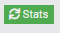

Cliccando sul pulsante qui sopra, è possibile riavviare un calcolo, operazione che richiederà alcuni secondi.

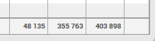

I totali in fondo alla tabella consentono di conoscere immediatamente la dimensione della cronologia.

## Visualizzazione

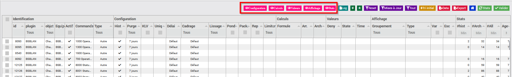

I pulsanti di visualizzazione consentono di selezionare i dati da visualizzare

* configurazione della cronologia
* i calcoli
* valori non consentiti
* visualizzazione tramite grafici
* le statistiche

A seconda dei propri interessi, è possibile attivare o disattivare la sezione che si desidera gestire. Per non sovraccaricare la schermata iniziale di Monitor, vengono visualizzati solo i dati di identificazione, di configurazione e le statistiche.

## Modifiche

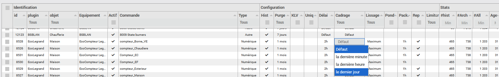

Per modificare un dato, basta cliccare sull'area interessata e inserire un nuovo valore.

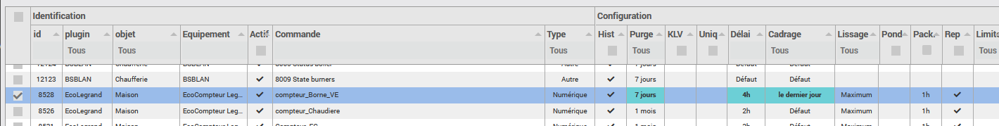

I dati modificati appaiono su sfondo magenta.

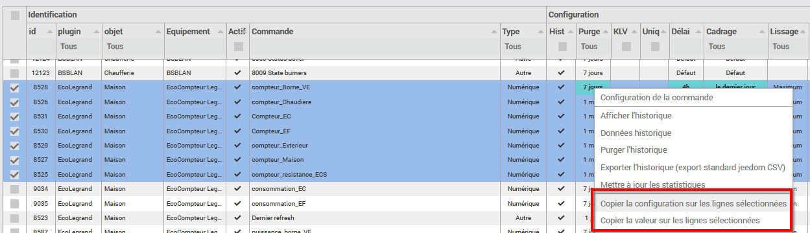

Facendo clic con il tasto destro del mouse su una riga, è possibile copiare la sua configurazione o uno dei suoi parametri sulle righe selezionate.

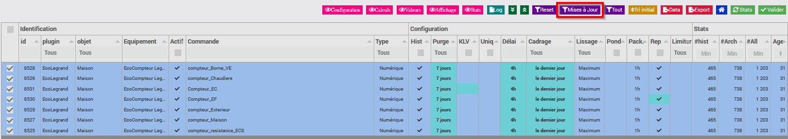

Per verificare i dati prima della convalida, è possibile visualizzare solo le righe modificate.

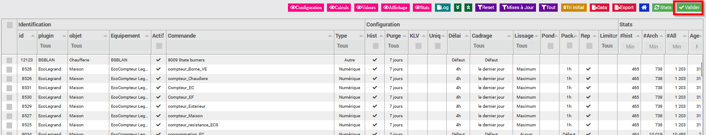

Dopo aver cliccato sul pulsante Conferma, i dati vengono aggiornati e lo sfondo delle celle modificate viene cancellato.

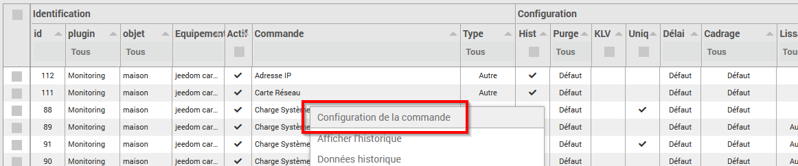

Si noti che facendo clic con il tasto destro del mouse su una riga è possibile avviare direttamente la configurazione avanzata dei comandi di Jeedom.

## Modifiche da un file Excel

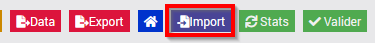

È inoltre possibile caricare le modifiche da un file Excel o CSV cliccando sul pulsante Importa. Questo pulsante consente di selezionare il file e di caricare i dati modificati nella tabella.

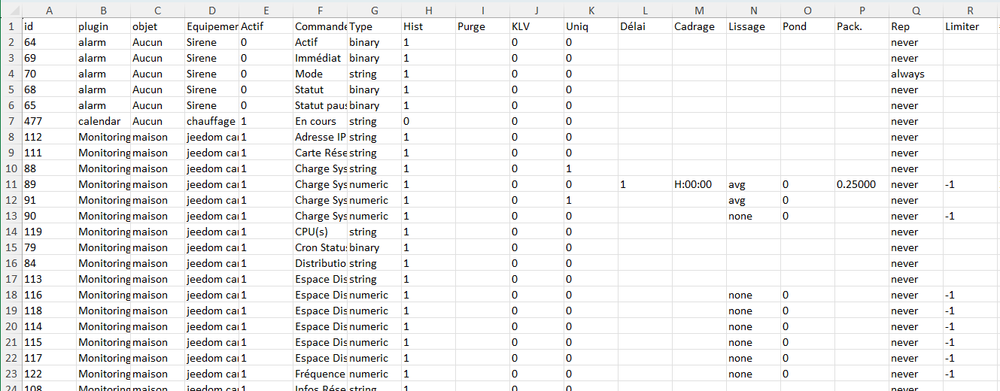

I dati devono avere lo stesso formato di quelli generati dall'esportazione. È quindi possibile esportare i dati, modificarli in Excel e poi caricare le modifiche nella tabella.

È inoltre possibile estrarre le impostazioni di archiviazione da un backup Jeedom e caricare le modifiche: ciò consente di visualizzare rapidamente le modifiche apportate dopo il backup ed eventualmente ripristinare una situazione precedente.

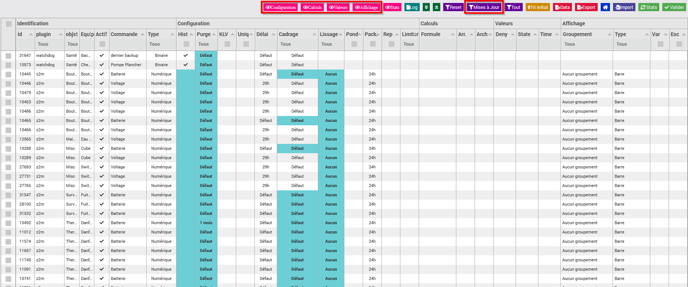

Una volta completata l'importazione, è possibile visualizzare solo i dati modificati cliccando sul filtro "Aggiornamenti". È inoltre possibile cliccare sui pulsanti di visualizzazione (Configurazione, Calcoli, ...) per visualizzare tutti i dati modificabili.

Per applicare le modifiche, clicca sul pulsante Conferma.

## Dati modificabili

Tutti i dati di configurazione della cronologia standard di Jeedom e quelli specifici del plugin archiplus possono essere modificati direttamente da Monitor.

Di seguito sono riportate in dettaglio le opzioni specifiche di Archiplus:

### KLV (Keep Last Value)

Consente di conservare sempre almeno una registrazione nella cronologia. Consulta la seguente FAQ per capire come utilizzare questa opzione [Keep Last Value](#keep-last-value).

### Uniq

Consente di eliminare i valori identici consecutivi in historyArch (ed eventualmente in history). Consultare la seguente FAQ per comprendere l'utilizzo di questa opzione [Uniq](#uniq-1).

### Tempi di consegna

Si tratta del periodo di tempo trascorso dopo il quale le registrazioni della cronologia vengono trasferite a historyArch. Per impostazione predefinita in Jeedom, questo parametro è lo stesso per tutti i comandi. Con archiplus, tale periodo può essere specificato per ogni singolo comando.

### Inquadramento

Consente di impostare il momento fino al quale vengono eliminati i dati storici e anche quello del trasferimento dei dati da history a historyArch, specificando un limite in giorni, ore o minuti. Consultare la seguente FAQ per comprendere come utilizzare questa opzione [Scadenza e intervallo](#scadenza-e-intervallo).

### Laghetto

Consente di calcolare una media ponderata tenendo conto del tempo, anziché una media dei valori registrati nel periodo. Per comprendere come utilizzare questa opzione, consultare la seguente FAQ [Livellamento e ponderazione](#livellamento-e-ponderazione).

### Pacchetto

Definisce l'intervallo con cui i dati verranno raggruppati durante la livellatura. Nell'archiviazione standard di Jeedom, questo parametro è lo stesso per tutti i comandi ed è un multiplo di ore. Con archiplus, è possibile specificare l'intervallo per ogni comando ed esprimere il valore anche in minuti (inserire il numero di minuti seguito dalla lettera m).  Consultare la seguente FAQ per comprendere l'utilizzo di questa opzione [Pack](#pack-1).

### Arrotondato

Di default in Jeedom, è possibile specificare l'arrotondamento per ogni comando. Il plugin consente inoltre di specificare un arrotondamento diverso durante la livellatura dei dati in historyArch. Consulta la seguente FAQ per capire come utilizzare questa opzione [Arrotondamento](#arrondi-1).

## Funzioni accessibili tramite il menu contestuale

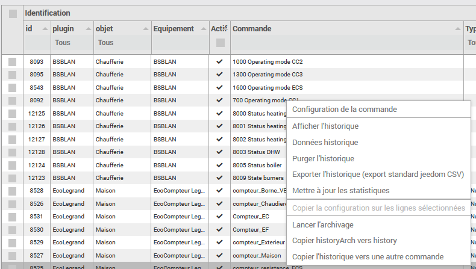

Facendo clic con il tasto destro del mouse in un punto qualsiasi di una riga della tabella, viene visualizzato il menu contestuale del comando. Oltre alle azioni già illustrate, questo menu consente di:

* visualizzare la cronologia sotto forma di grafico  (richiamo della funzione standard di Jeedom)
* visualizzare i dati memorizzati nelle tabelle history e historyArch
* cancellare la cronologia fino a una data specifica
* esportare i dati storici in formato CSV (richiamo della funzione standard di Jeedom)
* aggiornare le statistiche relative alla linea in questione
* avviare l'archiviazione solo per l'ordine in questione
* copiare i dati da historyArch a history: consulta la seguente FAQ per capire come utilizzare questa azione  [da historyArch a history](#copiare-i-dati-da-historyarch-a-history)
* copiare la cronologia dell'ordine selezionato in un altro ordine

# Dati storici

## Accesso

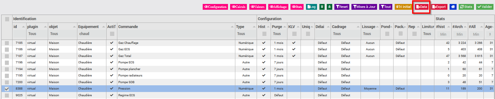

L'accesso ai dati nelle tabelle history e historyArch avviene tramite:

* il menu contestuale di Monitor (vedi sopra)
* la selezione di una o più righe seguita dalla pressione del pulsante Data.

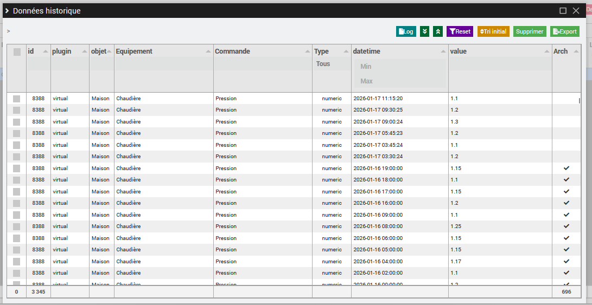

I dati vengono visualizzati in una finestra modale ordinati per data e ora in ordine decrescente.

## Modifica

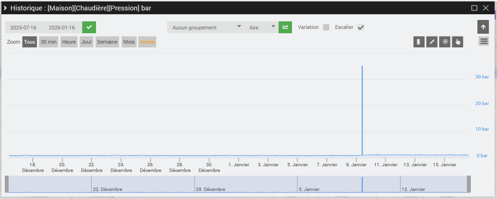

A volte capita di riscontrare valori anomali, in questo caso a seguito della manutenzione della caldaia.

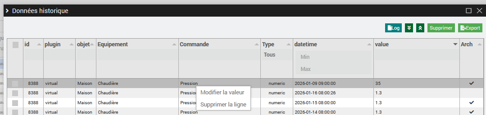

Il menu contestuale consente di modificare o eliminare il valore in questione.

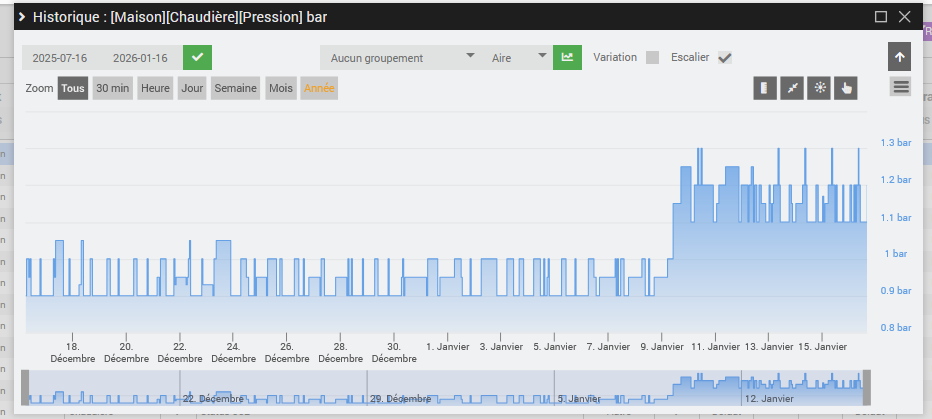

Dopo la correzione, la visualizzazione della cronologia risulta molto più significativa.

## Elimina

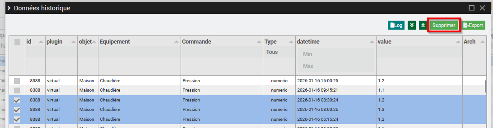

È inoltre possibile eliminare più dati storici selezionandoli e cliccando sul pulsante "Elimina".

## Esportazione

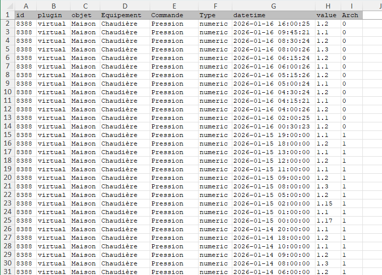

Il pulsante "Esporta" consente di esportare i dati.

Si noti che questi file possono essere modificati in Excel per poi essere importati tramite il modulo Import.

# Il modulo Import

Il modulo Import consente di importare dati storici in uno o più comandi di tipo INFO.

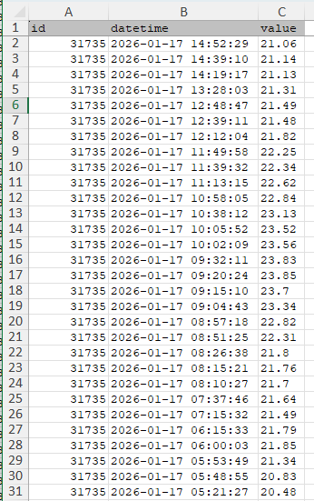

Il file da importare deve essere in formato Excel o CSV e deve contenere almeno le seguenti 3 colonne (le altre saranno ignorate):

* id: ID dell'ordine
* datetime: data e ora dei dati storici nel formato AAAA-MM-GG HH:MM:SS (è supportato anche il formato datetime interno di Excel)
* value: valore da importare

Verificare che i dati estratti dai moduli Monitor o Restore siano nel formato corretto.

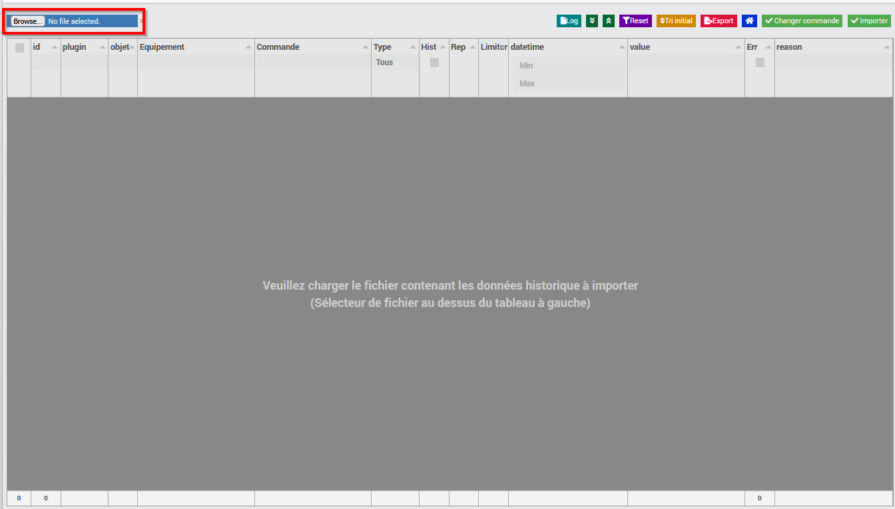

La prima operazione da eseguire è selezionare il file contenente i dati.

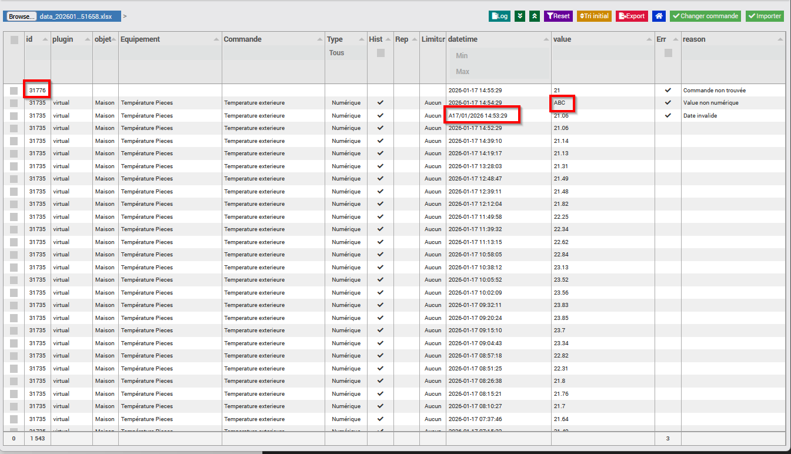

Una volta completato il caricamento, vengono caricati i dati storici contenuti nel file.

I dati del comando INFO vengono estratti da Jeedom.

Viene eseguito un controllo e vengono individuati i dati errati.

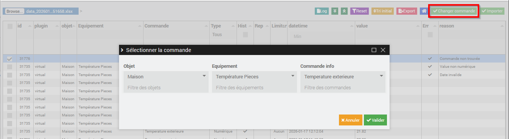

È possibile assegnare le righe caricate a un altro comando selezionando la o le righe interessate e cliccando sul pulsante "Cambia comando".

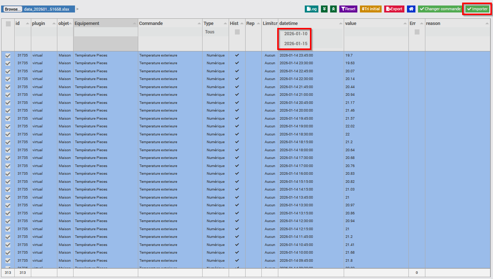

Per importare i dati storici in Jeedom, è necessario selezionare la o le righe interessate (in questo caso filtrando per un intervallo di date) e fare clic sul pulsante "Importa". Le righe che presentano errori vengono ignorate.

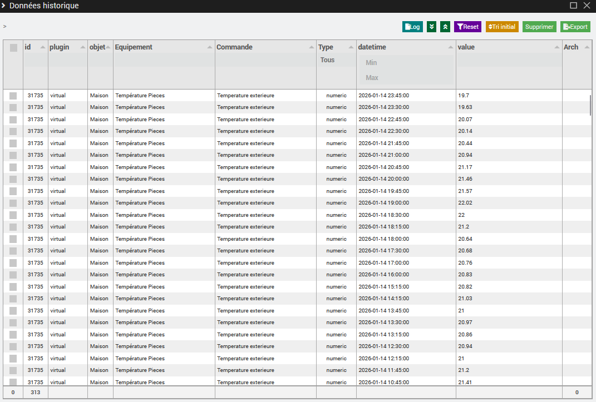

Si noti che l'importazione viene eseguita tramite il metodo standard cmd::addHistoryValue. Vengono quindi eseguiti i controlli e le elaborazioni standard di Jeedom. I nuovi inserimenti vengono memorizzati nella tabella history.

# Il modulo Restore

Il modulo Restore consente di estrarre i dati storici da un archivio standard Jeedom e di esportarli per poterli importare con il modulo Import.

Tutte le elaborazioni vengono eseguite localmente sul browser web. Tutti i comandi e i dati storici vengono caricati nella memoria del browser. Il programma è stato testato con 1,5 milioni di righe in history e historyArch. Il numero massimo di dati caricabili dipende dalla RAM assegnata al browser e non può essere determinato a priori. Dovrebbe tuttavia essere in grado di caricare la maggior parte dei backup in cui la cronologia non ha raggiunto dimensioni eccessive.

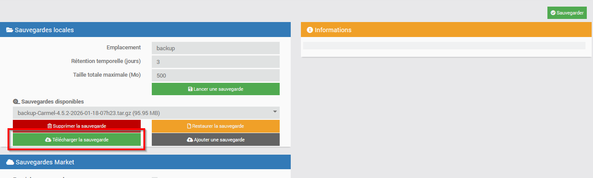

Il primo passo consiste nel recuperare il backup in locale sul computer. Per la gestione dei backup Jeedom, consultare la seguente documentazione [qui](https://doc.jeedom.com/fr_FR/core/4.5/backup).

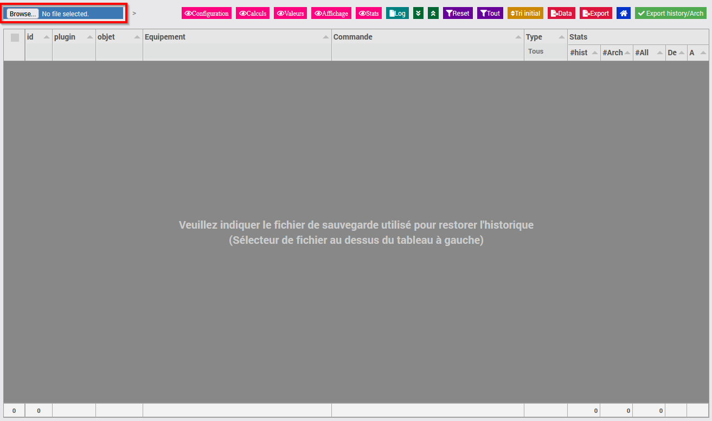

Avviare il modulo Restore e selezionare l'archivio che si desidera utilizzare.

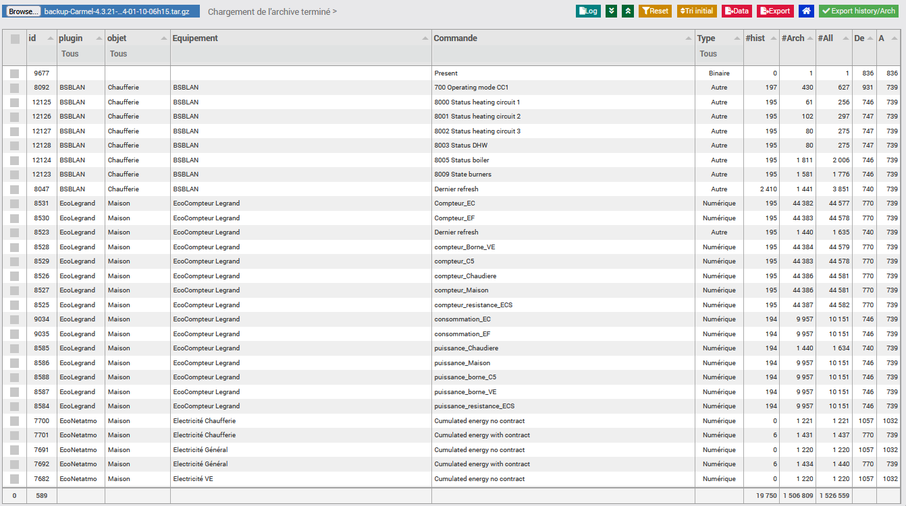

Dopo pochi secondi, vengono visualizzati i comandi con la cronologia.

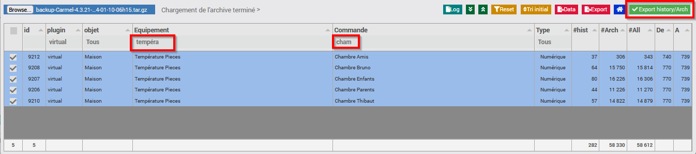

È possibile selezionare i comandi di proprio interesse e avviare l'esportazione.

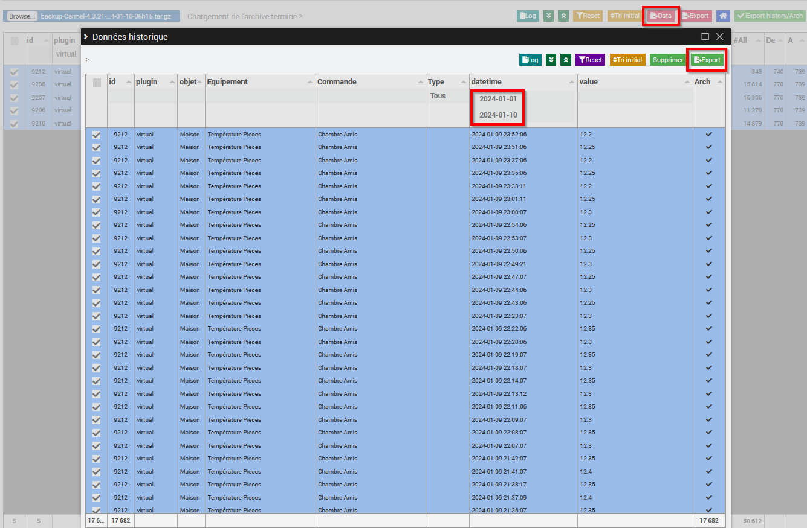

È inoltre possibile visualizzare i dati storici relativi e selezionare quelli da esportare.

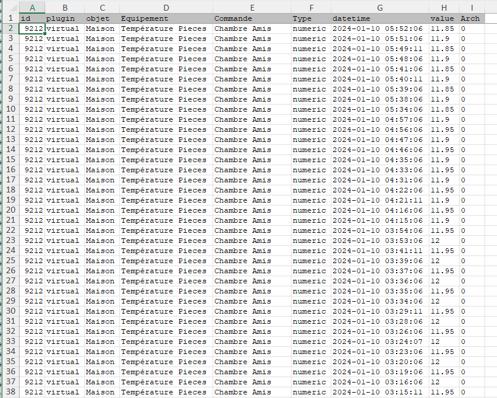

In entrambi i casi, troverete un file di esportazione che potrete utilizzare per effettuare un'importazione con il modulo Import.

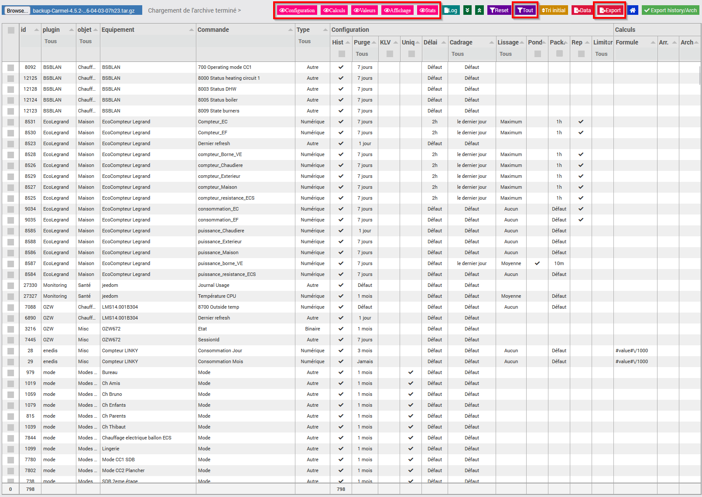

Cliccando sui pulsanti di visualizzazione, è possibile visualizzare i parametri dei comandi INFO così come erano al momento del salvataggio. Il filtro "Tutto" consente di visualizzare tutti i comandi INFO.

Il pulsante "Esporta" consente di generare un file che potrà essere utilizzato per caricare nel modulo Monitor le differenze di configurazione rispetto al backup.

# Domande frequenti

## Mantieni l'ultimo valore

In alcuni casi, è necessario disporre dell'ultimo valore del comando INFO.

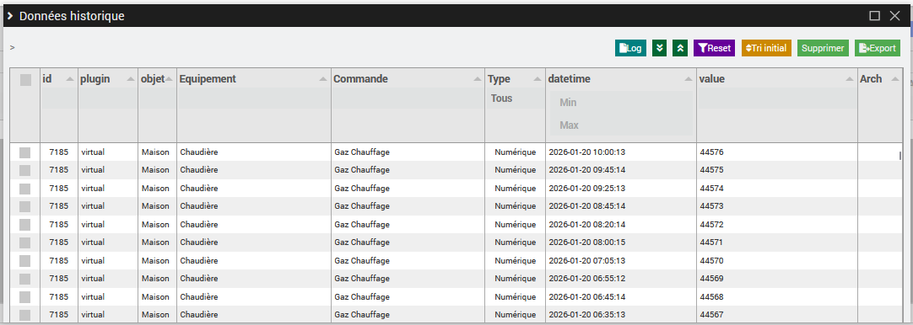

Prendiamo ad esempio il caso di una caldaia di cui si rileva periodicamente il contatore del gas destinato al riscaldamento.

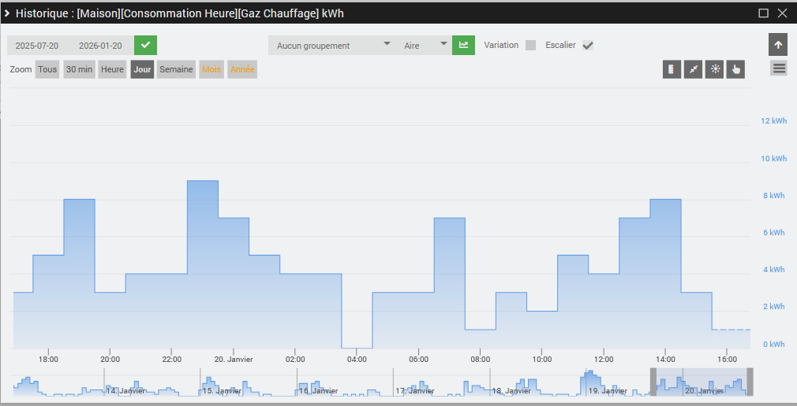

Uno scenario eseguito ogni ora consente di calcolare il consumo orario calcolando la differenza tra il valore registrato nella cronologia all'inizio e alla fine dell'ora. A tal fine, è sufficiente una cronologia di un giorno.

Tuttavia, al termine della stagione di riscaldamento, la cronologia del contatore del riscaldamento viene cancellata e non è più disponibile per calcolare il primo consumo orario al momento dell'accensione del riscaldamento nella stagione successiva.

L'attivazione dell'opzione "Keep Last Value" consente di ovviare a questo problema senza dover ricorrere a espedienti di programmazione o conservare una cronologia per un anno.

## Uniq

Jeedom consente di evitare i duplicati nella tabella "history" grazie all'opzione "Ripeti i valori identici", che è disattivata per impostazione predefinita.

Esistono tuttavia diverse situazioni in cui i valori identici consecutivi non vengono ignorati:

  * se il sottotipo del comando è Binario o Altro
  * se l'aggiornamento viene effettuato con il metodo cmd::event anziché con eqLogic::checkAndUpdateCmd. Molti plugin funzionano ancora con il metodo cmd::event, che è più datato e pertanto non elimina i duplicati.

Durante l'archiviazione, se non viene applicato alcun livellamento, i dati della cronologia vengono trasferiti direttamente in historyArch e quindi i duplicati vengono copiati.

L'attivazione dell'opzione Uniq consente di eliminare i duplicati in historyArch durante l'archiviazione specifica di archiplus.

Inoltre, se il plugin è configurato in modo da non copiare le voci della cronologia in historyArch, verranno eliminati anche i duplicati presenti nella cronologia.

## Tempistiche e definizione dell'ambito

Per impostazione predefinita, il momento a partire dal quale vengono eliminati i dati in history e historyArch è definito dal parametro "Pulisci cronologia", espresso in ore. Un valore predefinito è impostato nella configurazione globale di Jeedom.

Pertanto, con una pulizia impostata su 7 giorni, se l'archiviazione viene avviata il 20/01/2025 alle 05:11:21, le registrazioni history e historyArch verranno eliminate fino al 13/01/2025 alle 05:11:21.

Il parametro "Cadrage" specifico di archiplus consente di impostare con maggiore precisione il momento dello spurgo. Pertanto, nell'esempio sopra riportato, il momento dello spurgo sarà:

* il 13/01/2025 alle 05:11:21 se non è definito alcun inquadramento
* il 13/01/2025 alle 05:11:00 con un'inquadratura sull'ultimo minuto
* il 13/01/2025 alle 05:00:00 con un'analisi incentrata sull'ultima ora
* il 13/01/2025 alle 00:00:00 con un'analisi incentrata sull'ultimo giorno

Il "Tempo prima dell'archiviazione" (in ore) consente di determinare a partire da quando le registrazioni della cronologia vengono trasferite a historyArch (con o senza consolidamento). Per impostazione predefinita, è definito a livello globale ed è quindi identico per tutti i comandi.

L'archiviazione specifica di archiplus consente di definire un intervallo di tempo specifico per ogni comando INFO e di utilizzare l'inquadramento visto sopra. Pertanto, con un intervallo di 2 ore, il momento del trasferimento da history a historyArch sarà:

* il 20/01/2025 alle 03:11:21 se non è definito alcun inquadramento
* il 20/01/2025 alle 03:11:00 con un'inquadratura sull'ultimo minuto
* il 20/01/2025 alle 03:00:00 con un'analisi dell'ultima ora
* il 20/01/2025 alle 00:00:00 con un filtro sull'ultimo giorno, indipendentemente dall'ora del giorno in cui viene avviata l'archiviazione

Si noti che il momento dello svuotamento non può essere successivo al momento del trasferimento di history verso historyArch e verrà quindi regolato automaticamente.

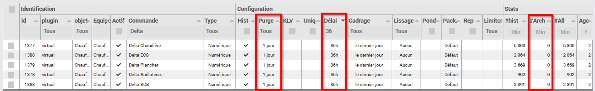

È possibile modificare questi parametri se, ad esempio, si desidera un cronologico dettagliato su un breve periodo (in questo caso massimo 36 ore) senza bisogno di un archivio consolidato. In questo modo si evita il trasferimento del cronologico verso historyArch, che non apporta alcun vantaggio.

## Lisciamento e ponderazione

Il livellamento avviene durante la copia dei dati da history a historyArch. Il processo di archiviazione prende in considerazione tutti i dati di history in base all'intervallo definito (per impostazione predefinita un'ora) e conserva un unico valore calcolato in base alla modalità di livellamento. Sono disponibili tre modalità:

* minimo: il più piccolo dei valori compresi nell'intervallo
* massimo: il valore più grande compreso nell'intervallo
* media: la media dei valori compresi nell'intervallo

Va notato che l'archiviazione standard non tiene conto del valore del comando all'inizio dell'intervallo e calcola la media dei valori presenti nell'intervallo, il che può falsare in modo significativo il risultato.

Il processo specifico di archiviazione di archiplus offre un'opzione Pond che consente di correggere questo fenomeno e di calcolare un risultato esatto sull'intervallo considerato.

Ciò è illustrato nell'esempio riportato di seguito.

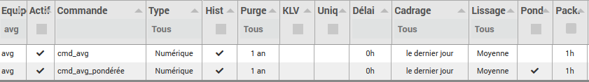

Consideriamo due comandi con le seguenti configurazioni.

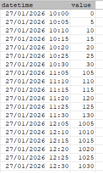

Hanno gli stessi record nella tabella history

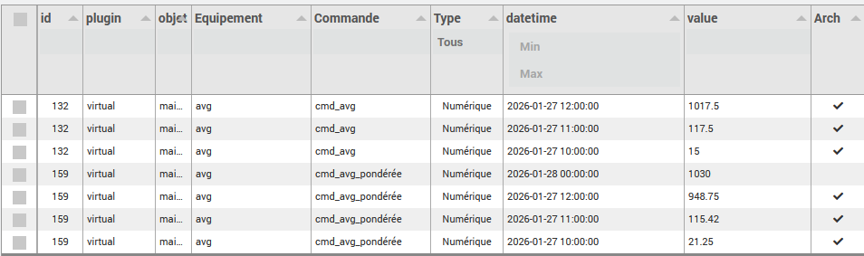

Dopo l'archiviazione, le voci in historyArch risultano diverse

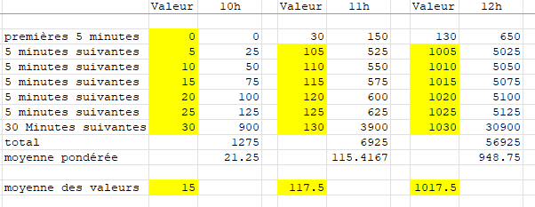

Con l'archiviazione standard, viene presa in considerazione la media dei valori nel periodo considerato.

Con l'archiviazione specifica di archiplus, viene calcolata la media ponderata del periodo. Si noti inoltre che viene aggiunta una voce nella cronologia per poter conoscere, al momento della prossima archiviazione, il valore iniziale del periodo (senza questa voce, verrebbe recuperata la media dell'ultimo periodo, il che falserebbe il calcolo).

## Pacchetto

Di default in Jeedom, l'intervallo (chiamato "pacchetto" in Jeedom) su cui è possibile applicare la livellatura è definito in ore ed è lo stesso per tutti i comandi INFO.

Tuttavia, potrebbe essere auspicabile un intervallo più breve e la possibilità di specificarlo per un comando INFO specifico.

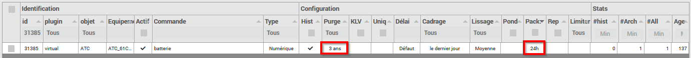

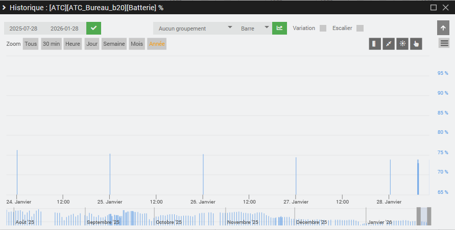

Per una batteria, può essere sufficiente mantenere un valore al giorno per un lungo periodo.

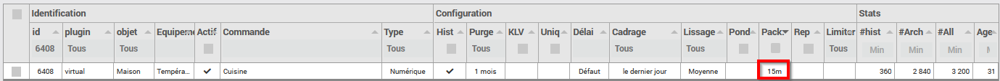

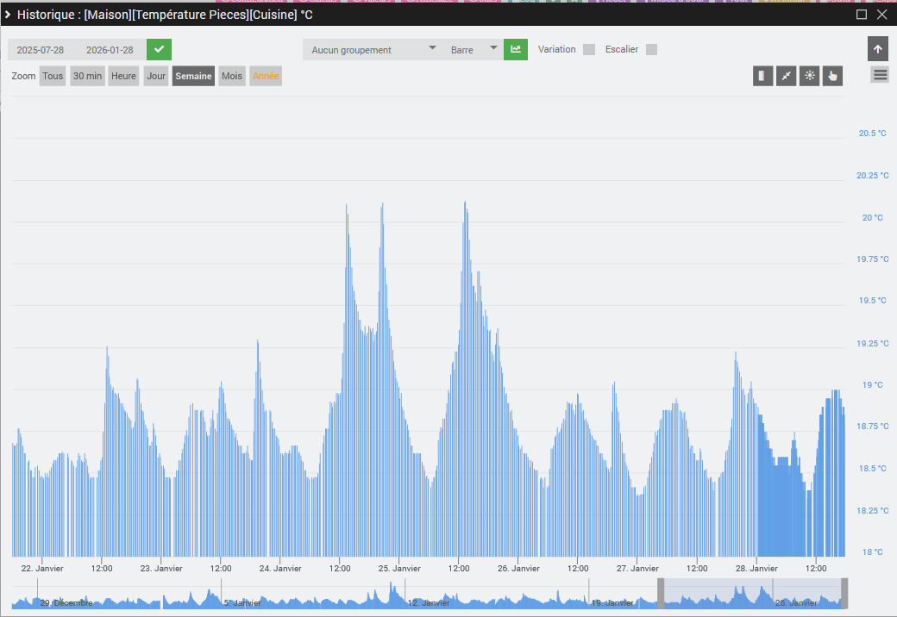

Per un termometro, un valore ogni quarto d'ora può essere più utile di un valore ogni ora.

Per indicare i minuti, inserire nel campo "Pack" il numero di minuti desiderato seguito dalla lettera "m", ad esempio 15m.

## Arrotondato

Di default, Jeedom consente di specificare il numero di cifre decimali di un valore di comando INFO.

Per alcuni comandi, può essere utile disporre di un valore preciso per un breve periodo e poi di uno meno preciso in seguito. Ad esempio, conoscere la temperatura esterna esatta è utile sul momento, ma non è più necessario dopo diversi giorni.

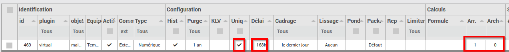

Il comando sopra riportato è configurato per conservare un storico con 1 cifra decimale per una settimana e uno senza cifre decimali oltre tale periodo.

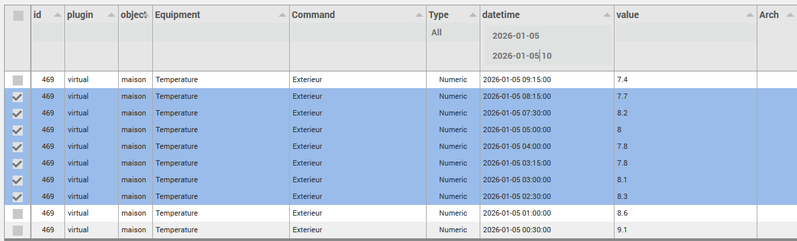

Prima dell'archiviazione, nella cronologia sono presenti 7 voci con valori compresi tra 7,7 °C e 8,3 °C.

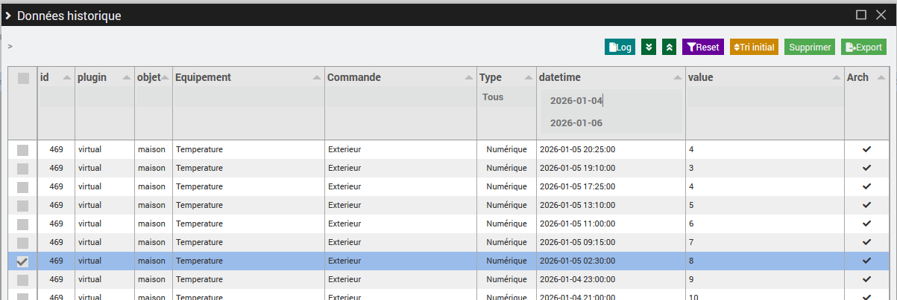

Dopo l'archiviazione, i 7 valori inseriti vengono arrotondati a 8 °C e l'opzione Uniq consente di conservarne uno solo.

## Copiare i dati da historyArch a history

Dopo aver installato archiplus, potresti voler consolidare i dati storici esistenti.

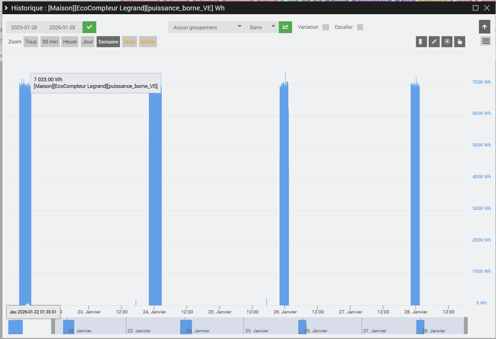

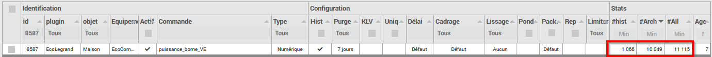

Ad esempio, per questo comando, una cronologia con intervalli di 10 minuti sarebbe sufficiente e ridurrebbe notevolmente il numero di registrazioni in historyArch.

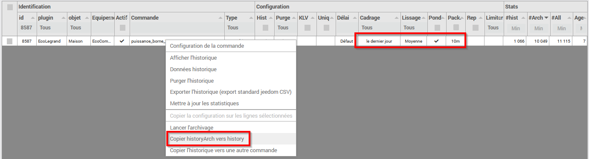

Dopo aver modificato le impostazioni, è possibile trasferire i dati da historyArch a history.

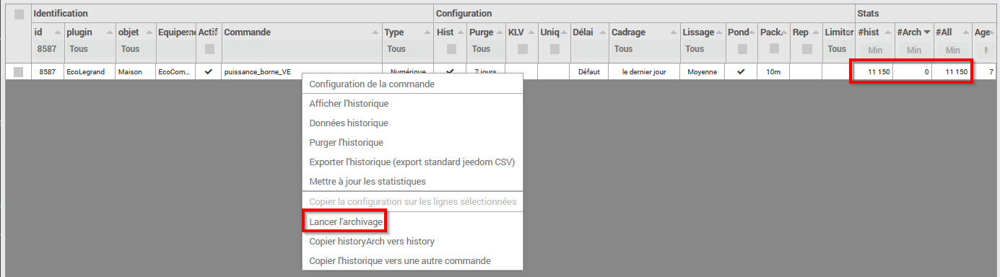

Una volta effettuato questo aggiornamento, è possibile avviare l'archiviazione tramite il comando INFO (oppure attendere che l'archiviazione venga avviata automaticamente durante la notte).

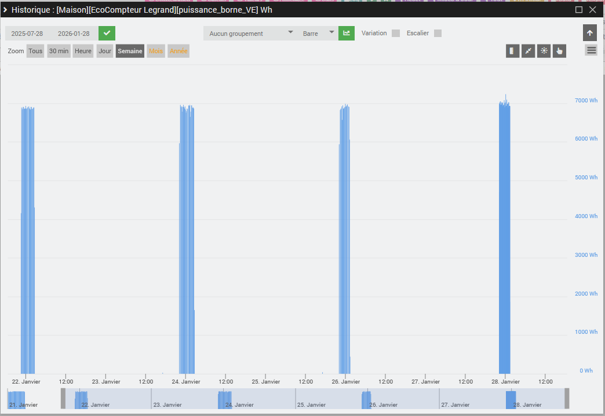

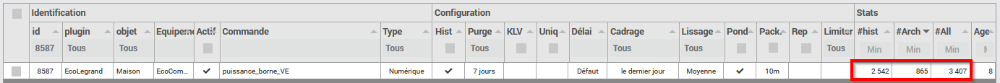

Dopo l'archiviazione, il numero di registrazioni si riduce notevolmente e la visualizzazione della cronologia risulta molto più veloce.

## Utilizzo di Archiplus in PHP

È possibile richiamare le funzioni di archiviazione e di elaborazione dei dati storici di archiplus direttamente all'interno di uno scenario o di una funzione PHP.

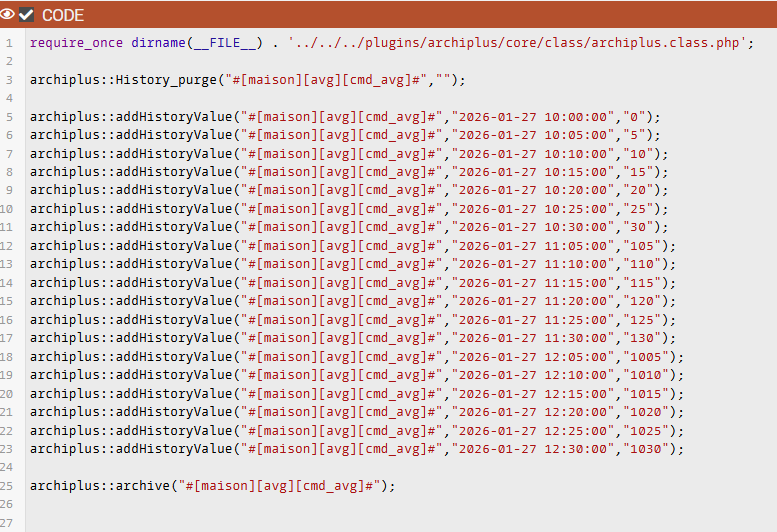

In questo caso, le funzioni archiplus vengono utilizzate in uno scenario per caricare la cronologia di un ordine e avviare l'archiviazione dello stesso.

`require_once dirname(__FILE__) . '../../../plugins/archiplus/core/class/archiplus.class.php';`

Questa riga consente di caricare il codice delle funzioni archiplus. Potrebbe essere necessario modificare il percorso per puntare alla classe del plugin.

Le funzioni disponibili si trovano nel codice della classe archiplus. Le principali sono:

* `archive($_cmd_id = '')`: avvia l'archiviazione di un ordine o di tutti gli ordini se non viene specificato alcun parametro
* `History_purge($_cmd_id, $_date='')`: elimina la cronologia relativa a un comando fino a una data e ora specificate (o l'intera cronologia se non viene specificato il secondo parametro)
* `addHistoryValue($_cmd_id, $_datetime, $_value)`: aggiunge una voce (o sostituisce quella esistente) nella cronologia richiamando la funzione standard di Jeedom
* `historyArch2history($_cmd_id, $_date_start = '', $_date_end = '')`: trasferisce i record da historyArch a history
  
È ovviamente possibile utilizzare le funzioni disponibili nella classe history.class.php dopo aver effettuato la dichiarazione `require_once` necessaria.

# I log

Se il livello di log nella configurazione del plugin è impostato almeno su Info, i vari eventi relativi ad archiplus verranno registrati nel log archiplus di Jeedom. È possibile accedervi direttamente tramite il pulsante "log" presente nei vari moduli di archiplus.

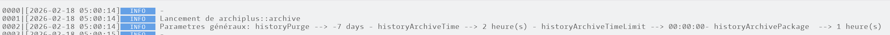

Durante l'archiviazione, vengono visualizzate le impostazioni generali di archiviazione di Jeedom.

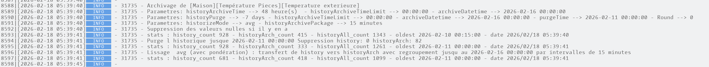

Successivamente, per ogni comando vengono riportate in dettaglio le operazioni eseguite e il numero di registrazioni presenti in history e historyArch prima e dopo tale comando.

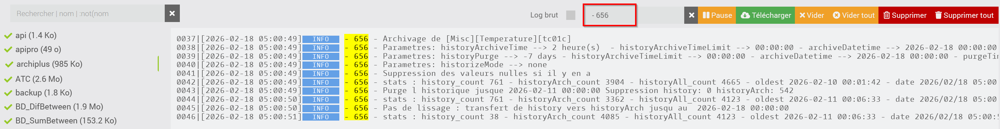

È possibile visualizzare il log relativo a un comando specifico inserendo il suo numero preceduto dai caratteri - e uno spazio nell'area di ricerca.

# Traduzione

L'interfaccia e i messaggi inviati nei log sono tradotti nelle 5 lingue supportate da Jeedom (grazie a @mips per lo sviluppo di ga-translation). Se si riscontrano errori di traduzione, è possibile aprire una richiesta di assistenza e, se possibile, allegare il file di traduzione corretto (che si trova nella directory core/i18n del plugin).

La documentazione del plugin è tradotta solo in inglese (le altre lingue rimandano alla traduzione inglese). La traduzione è effettuata tramite un traduttore automatico. Le schermate, invece, non sono tradotte.

# Recensioni

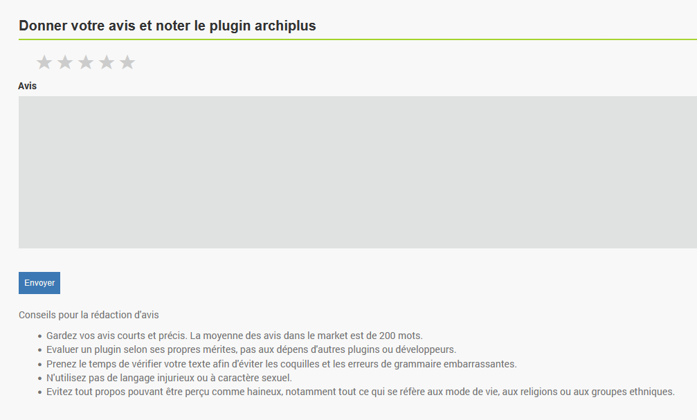

Se ti piace questo plugin, ti invitiamo a lasciare una valutazione e un commento sul Jeedom Market, ci fa sempre piacere: <https://jeedom.com/market/index.php?v=d&p=market_display&id=xxxx#>
